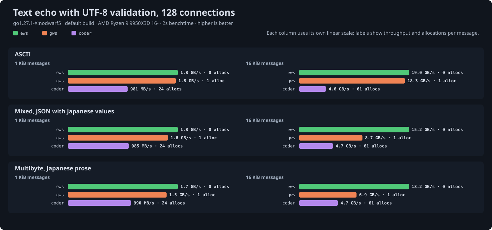

# ews

A WebSocket library for Go built around plain `[]byte`: no allocations on the
hot paths, streaming in both directions, and the transport left in your hands.

```sh
go get github.com/33TU/ews@latest
```

Requires Go 1.27. Passes the full Autobahn test suite.


Echo throughput with permessage-deflate on, one round trip at a time per
connection, on a 9950X3D. With context takeover the lead is the compressor
that stays attached to the connection; without it the libraries tie until
the allocations of a 256 KiB message separate them. Uncompressed, every
well-built Go library ties on this test up to 16 KiB and ews pulls ahead at
256 KiB; [bench/](bench/README.md) has that chart and the rest.

## Packages

| package | what it does |
|---|---|
| `ws` | connections: read and write messages over an upgraded transport |
| `transport` | get a connection: `Upgrade` inside `net/http`, `Server` without it, `Dial` for clients |
| `events` | serve connections through a handler with one method per event, over `transport` and `ws.Serve` |
| `handshake` | the opening handshake rules, including `permessage-deflate` negotiation |
| `codec` | frame encoding and decoding |
| `deflate` | per-message compression with context takeover |

## Server

```go
server := &transport.Server{
	Handshake: handshake.Options{
		Compression: &handshake.Compress{Level: flate.BestSpeed, ContextTakeover: true},
	},
	Handler: func(conn net.Conn, res handshake.Result, _ *transport.Request) {
		c, err := ws.NewConn(conn, ws.Config{Role: ws.Server, Compression: res.Compression})
		if err != nil {
			return
		}
		for {
			op, payload, err := c.ReadMessage() // Borrowed until the next read: copy to keep it.
			if err != nil {
				return
			}
			if err := c.Write(op, payload); err != nil {
				return
			}
		}
	},
}
ln, _ := net.Listen("tcp", ":8080")
log.Fatal(server.Serve(ln))
```

Inside an existing `net/http` handler, `transport.Upgrade(w, r, opts)` returns the
same `conn, res` pair. Read on a goroutine of your own and return from the
handler: `net/http` keeps about 10 KB of request state alive until it returns,
100 MB at ten thousand connections. The read loop above is what `ws.Serve` does:

```go
err := ws.Serve(c, ws.MessageFunc(func(c *ws.Conn, op codec.Opcode, payload []byte) error {
	return c.Write(op, payload) // Returns a *ws.CloseError when the peer closes.
}))
```

Or as a handler with one method per event, the shape a gws handler takes.
Every event is written out below to show the interface; `events.Base`
supplies defaults for whatever a handler leaves out, and a panic in a handler
ends that connection rather than the process. The whole `echo-events` example:

```go
// echo serves every connection. The read deadline set on open is refreshed
// by each message and pong, so a silent peer is dropped after a minute.
type echo struct{}

func (echo) OnOpen(c *events.Conn) {
	log.Printf("%s connected", c.Request.RemoteAddr)
	c.SetReadDeadline(time.Now().Add(time.Minute))
	c.UserData = time.Now() // Anything you want to keep per connection.
}

func (echo) OnMessage(c *events.Conn, op codec.Opcode, payload []byte) error {
	c.SetReadDeadline(time.Now().Add(time.Minute))
	return c.Write(op, payload)
}

// OnPing owns the reply: a handler that takes pings must send the pong.
func (echo) OnPing(c *events.Conn, payload []byte) error {
	return c.Pong(payload)
}

func (echo) OnPong(c *events.Conn, _ []byte) error {
	return c.SetReadDeadline(time.Now().Add(time.Minute))
}

// OnClose is the last event: a *ws.CloseError when the peer closed
// cleanly, a *events.PanicError when a handler panicked, or the read error.
func (echo) OnClose(c *events.Conn, err error) {
	since := time.Since(c.UserData.(time.Time)).Round(time.Second)
	if _, ok := errors.AsType[*ws.CloseError](err); ok {
		log.Printf("%s closed after %s", c.Request.RemoteAddr, since)
		return
	}
	log.Printf("%s lost after %s: %v", c.Request.RemoteAddr, since, err)
}

func main() {
	server := &transport.Server{
		Handshake: handshake.Options{
			Compression: &handshake.Compress{Level: flate.BestSpeed, ContextTakeover: true},
		},
		Handler: events.Serve(echo{}, ws.Config{MaxMessageSize: 32 << 20, ValidateUTF8: true}),
	}

	ln, err := net.Listen("tcp", ":9005")
	if err != nil {
		log.Fatal(err)
	}

	log.Fatal(server.Serve(ln))
}
```

## Client

```go
conn, res, err := transport.Dial(ctx, "wss://example.com/socket", transport.DialOptions{})
if err != nil {
	return err
}
defer conn.Close()
c, err := ws.NewConn(conn, ws.Config{Role: ws.Client, Compression: res.Compression})
```

Or with the events shape, where `Dial` runs the handler until the connection
ends and returns the error `OnClose` saw, so a reconnect loop is a loop over
it. State you have at dial time reaches `OnOpen` through `Config.UserData`:

```go
type client struct{ events.Base }

func (client) OnOpen(c *events.Conn) { c.Write(codec.Text, []byte("hello")) }

func (client) OnMessage(c *events.Conn, op codec.Opcode, payload []byte) error {
	log.Printf("%s", payload)
	return nil
}

err := events.Dial(ctx, "wss://example.com/socket", transport.DialOptions{}, client{}, ws.Config{UserData: state})
```

## Reading and writing

Three ways to read, one goroutine at a time:

- `ReadMessage()` returns the whole message, valid until the next read.
- `NextMessage()` then `Read(b)` delivers it in chunks as frames arrive, ending
  with `io.EOF`. Compressed messages inflate as they stream.
- `WriteTo(w)` relays the rest of the message to an `io.Writer`; `io.Copy`
  uses it.

Writing from any goroutine:

- `Write(op, p)` sends one message.
- `BeginMessage`, `WriteChunk`, `EndMessage` send a message of unknown length
  as fragments; `WriteFrom(op, r)` does that for an `io.Reader`.
- `NewQueue(limit)` gives an asynchronous queue that coalesces a burst into
  one write and refuses with `ErrQueueFull` past its limit instead of
  blocking on a slow peer.
- `Prepare(op, p)` encodes a message once for every recipient; hand it to
  `WritePrepared` or a queue's `SendPrepared`. `PrepareAppend` lets an
  encoder marshal straight into the frame.
- `NetConn(c, op)` turns the connection into a `net.Conn` for tunneling.

Pings are answered and close frames echoed by the default `ControlHandler`.
Deadlines and addresses are forwarded from the `net.Conn` you were given;
closing it is yours, through `Transport()` if you no longer hold it.
`examples/broadcast` shows a hub with a read deadline and one ping ticker.

## Examples

Runnable programs under `examples/`, each started with `go run ./examples/<name>`:

| Program | Shows |
|---|---|
| `echo` | `transport.Server` with the synchronous read and write loop; the shape the Autobahn suite tests |
| `echo-http` | the same behind an `http.Handler` through `transport.Upgrade`, using `ws.Serve`, with optional TLS |
| `echo-stream` | relaying each message frame by frame with `NextMessage` and `WriteFrom`, memory bounded by `FragmentSize` |
| `echo-queue` | replies through a `Queue`, so a slow peer is dropped at its limit instead of stalling the reader |
| `echo-events` | the same server as an `events.Handler`, one method per event, the shape a gws handler takes |
| `broadcast` | a hub with a queue per connection, one ping ticker, and a read deadline |
| `client` | `transport.Dial`; types lines to any of the servers, or streams a file through one and checks the echo |
| `client-events` | the chat client as an `events.Handler` through `events.Dial`, with dial-time state in `UserData` |
| `tunnel` | TCP over WebSocket both ways with `NetConn`, so `io.Copy` carries any protocol; `ssh` through a WebSocket port |

The read, write, queue, prepare and tunnel methods have runnable examples on
[pkg.go.dev](https://pkg.go.dev/github.com/33TU/ews/ws#pkg-examples). Four
that show what is particular to ews:

Read a message in chunks as its frames arrive, inflating compressed ones on the way:

```go
op, err := c.NextMessage()
buf := make([]byte, 32<<10)
for {
	n, err := c.Read(buf)
	if err == io.EOF {
		break
	}
	handle(op, buf[:n])
}
```

Send a burst without waiting on the peer; a client more than 1 MiB behind is dropped:

```go
q := c.NewQueue(1 << 20)
for _, event := range events {
	if err := q.Send(codec.Text, event); err != nil { // ErrQueueFull past the limit.
		conn.Close()
		return
	}
}
```

Broadcast one message to every connection, encoded and compressed once:

```go
p, _ := ws.Prepare(codec.Text, payload)
for _, q := range queues {
	q.SendPrepared(p) // Shared bytes, nothing allocated per recipient.
}
```

Tunnel another protocol over the connection:

```go
nc := ws.NetConn(c, codec.Binary) // A net.Conn: one message per Write.
go io.Copy(nc, upstream)
io.Copy(upstream, nc)
```

## Compression

Pass the negotiated `res.Compression` into `ws.Config` and messages of at
least `MinSize` bytes, 128 by default, are compressed. A connection with
send context takeover keeps a compressor attached, about 800 KB, and is
fastest on small messages; `CompressionShared: true` borrows a pooled one per
message instead and wins on large messages once hundreds of connections
compete for cache.

## Performance

Uncompressed echo sits within a few percent of a raw TCP echo for every
well-built Go library; the differences are in compression, large messages,
fan-out, memory and allocations, where ews allocates nothing on the hot
paths. Two results stand out. In lxzan's
[go-websocket-benchmark](https://github.com/33TU/go-websocket-benchmark),
the harness behind gws's published chart, every server below answers the
full offered load of the rate test at 10k connections, and the difference is
the CPU it takes:

| server | echoes per second per CPU percent | CPU |
|---|---|---|
| ews | 10,222 | 195% |
| ews_sync | 6,079 | 327% |
| quickws | 5,897 | 337% |
| nbio_std | 5,851 | 341% |
| gws_std | 5,809 | 343% |
| gws | 5,687 | 350% |

And at 256 KiB payloads over 10,000 connections, where every library reaches
the loopback ceiling, memory follows what each holds per message:

| server | echoes/s | median round trip | CPU | memory |
|---|---|---|---|---|
| ews | 16,384 | 10.1 ms | 175% | 147 MB |
| ews_sync | 16,786 | 6.5 ms | 146% | 156 MB |
| nbio_std | 16,706 | 9.9 ms | 177% | 331 MB |
| gws | 13,294 | 16.6 ms | 408% | 310 MB |
| gorilla | 14,874 | 8.3 ms | 111% | 4.99 GB |
| quickws | 14,202 | 14.5 ms | 231% | 5.35 GB |
| nettyws | 12,995 | 14.5 ms | 208% | 9.99 GB |




[bench/](bench/README.md) has the method, the compressed echo charts, the
SIMD build's results, the TLS results and what is behind each number, with raw
output committed so every table can be regenerated.

## Development

```sh
just check           # fmt, vet, race suite
just test-simd
just autobahn        # needs podman or docker
just bench-echo      # also bench-broadcast, bench-utf8, and -simd variants
```

The benchmark recipes run at `GOMAXPROCS=8` so results from different
machines measure the same shape; each results file records the thread count
and library versions. The committed tables were run pinned to the eight cores
of one die (`taskset -c 0-7`), so the threads share one L3.
