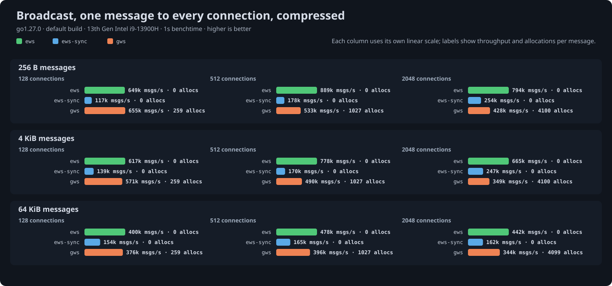

# ews

A WebSocket library for Go built around plain `[]byte`: no allocations on the
hot paths, streaming in both directions, and the transport left in your hands.

```sh
go get github.com/33TU/ews@latest
```

Requires Go 1.27. Passes the full Autobahn test suite.

## Packages

| package | what it does |
|---|---|
| `ws` | connections: read and write messages over an upgraded transport |
| `transport` | get a connection: `Upgrade` inside `net/http`, `Server` without it, `Dial` for clients |
| `handshake` | the opening handshake rules, including `permessage-deflate` negotiation |
| `codec` | frame encoding and decoding |
| `deflate` | per-message compression with context takeover |

## Server

```go
server := &transport.Server{
	Handshake: handshake.Options{Compression: &handshake.Compress{Level: flate.BestSpeed, ContextTakeover: true}},
	Handler: func(conn net.Conn, res handshake.Result, _ *transport.Request) {
		c, err := ws.NewConn(conn, ws.Config{Role: ws.Server, Compression: res.Compression})
		if err != nil {
			return
		}
		for {
			op, payload, err := c.ReadMessage() // Borrowed until the next read: copy to keep it.
			if err != nil {
				return
			}
			if err := c.Write(op, payload); err != nil {
				return
			}
		}
	},
}
ln, _ := net.Listen("tcp", ":8080")
log.Fatal(server.Serve(ln))
```

Inside an existing `net/http` handler, `transport.Upgrade(w, r, opts)` returns the
same `conn, res` pair. Read on a goroutine of your own and return from the
handler: `net/http` keeps about 10 KB of request state alive until it returns,
100 MB at ten thousand connections. The read loop above is what `ws.Serve` does:

```go
err := ws.Serve(c, ws.MessageFunc(func(c *ws.Conn, op codec.Opcode, payload []byte) error {
	return c.Write(op, payload) // Returns a *ws.CloseError when the peer closes.
}))
```

## Client

```go
conn, res, err := transport.Dial(ctx, "wss://example.com/socket", transport.DialOptions{})
if err != nil {
	return err
}
defer conn.Close()
c, err := ws.NewConn(conn, ws.Config{Role: ws.Client, Compression: res.Compression})
```

## Reading and writing

Three ways to read, one goroutine at a time:

- `ReadMessage()` returns the whole message, valid until the next read.
- `NextMessage()` then `Read(b)` delivers it in chunks as frames arrive, ending
  with `io.EOF`. Compressed messages inflate as they stream.
- `WriteTo(w)` relays the rest of the message to an `io.Writer`; `io.Copy`
  uses it.

Writing from any goroutine:

- `Write(op, p)` sends one message.
- `BeginMessage`, `WriteChunk`, `EndMessage` send a message of unknown length
  as fragments; `WriteFrom(op, r)` does that for an `io.Reader`.
- `NewQueue(limit)` gives an asynchronous queue that coalesces a burst into
  one write and refuses with `ErrQueueFull` past its limit instead of
  blocking on a slow peer.
- `Prepare(op, p)` encodes a message once for every recipient; hand it to
  `WritePrepared` or a queue's `SendPrepared`.
- `NetConn(c, op)` turns the connection into a `net.Conn` for tunneling.

Pings are answered and close frames echoed by the default `ControlHandler`.
Deadlines, keepalive and closing belong to the `net.Conn` you were given;
`examples/broadcast` shows a hub with a read deadline and one ping ticker.

## Examples

Read a message in chunks:

```go
op, err := c.NextMessage()
buf := make([]byte, 32<<10)
for {
	n, err := c.Read(buf) // Compressed messages inflate as frames arrive.
	if err == io.EOF {
		break
	}
	handle(op, buf[:n])
}
```

Relay a message without a buffer of your own:

```go
if _, err := c.NextMessage(); err == nil {
	_, err = io.Copy(file, c) // Uses WriteTo, frame by frame.
}
```

Send from a reader, fragmented as it is read:

```go
_, err := c.WriteFrom(codec.Binary, file)
```

Send a burst asynchronously; a client more than 1 MiB behind is dropped:

```go
q := c.NewQueue(1 << 20)
for _, event := range events {
	if err := q.Send(codec.Text, event); err != nil { // ErrQueueFull past the limit.
		conn.Close()
		return
	}
}
```

Broadcast one message to every connection, encoded once:

```go
p, _ := ws.Prepare(codec.Text, payload)
for _, q := range queues {
	q.SendPrepared(p) // Shared bytes; compressed once per configuration.
}
```

Tunnel another protocol over the connection:

```go
nc := ws.NetConn(c, codec.Binary) // A net.Conn: one message per Write.
go io.Copy(nc, upstream)
io.Copy(upstream, nc)
```

Keepalive with one read deadline and no timer per connection:

```go
type keepalive struct {
	ws.DefaultControlHandler
	conn net.Conn
}

func (k keepalive) OnPong(*ws.Conn, []byte) error {
	return k.conn.SetReadDeadline(time.Now().Add(time.Minute))
}

c, _ := ws.NewConn(conn, ws.Config{Role: ws.Server, ControlHandler: keepalive{conn}})
// Refresh the deadline before each read; ping all connections from one ticker.
```

Reject invalid UTF-8 in text messages with close code 1007:

```go
c, _ := ws.NewConn(conn, ws.Config{Role: ws.Server, ValidateUTF8: true})
```

Route and check origins before the handshake completes:

```go
server.Accept = func(req *transport.Request) int {
	if req.Path != "/socket" || req.Header["Origin"] != "https://example.com" {
		return 403 // Any HTTP status refuses; zero accepts.
	}
	return 0
}
```

## Compression

Pass the negotiated `res.Compression` into `ws.Config` and messages of at
least `MinSize` bytes, 128 by default, are compressed. A connection with
send context takeover keeps a compressor attached, about 800 KB, and is
fastest on small messages; `CompressionShared: true` borrows a pooled one per
message instead and wins on large messages once hundreds of connections
compete for cache.

## Performance

Benchmarks against gws, coder/websocket and gorilla/websocket live in
`bench/`, with results, charts and raw output committed:
[echo](bench/echo/RESULTS.md), [broadcast](bench/broadcast/RESULTS.md),
[text validation](bench/utf8/RESULTS.md). Uncompressed echo sits within a few
percent of a raw TCP echo for every library; the differences are in
compression, large messages, fan-out and allocations, where ews allocates
nothing.




Build with `GOEXPERIMENT=simd` for SIMD masking and UTF-8 validation;
results for that build are beside the default ones.

ews is also wired into a fork of lxzan's
[go-websocket-benchmark](https://github.com/33TU/go-websocket-benchmark),
the harness behind gws's published chart, with current library versions and
[results](https://github.com/33TU/go-websocket-benchmark/tree/main/results)
from its echo and rate tests at 10k connections.

## Development

```sh
just check           # fmt, vet, race suite
just test-simd
just autobahn        # needs podman or docker
just bench-echo      # also bench-broadcast, bench-utf8, and -simd variants
```

The benchmark recipes run at `GOMAXPROCS=8` so results from different
machines measure the same shape; each results file records the thread count
and library versions. The committed tables were run pinned to the eight cores
of one die (`taskset -c 0-7`), so the threads share one L3.
