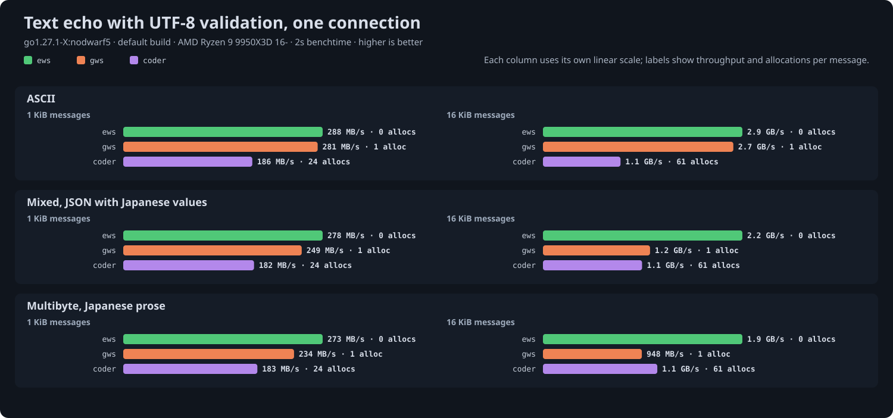

# ews

A lightweight WebSocket frame encoder and decoder for Go, built around plain `[]byte`.

**Work in progress.** The API is still taking shape.

The frame API lives in `github.com/33TU/ews/codec`, message compression in `github.com/33TU/ews/deflate`, connections in `github.com/33TU/ews/ws`, handshake rules in `github.com/33TU/ews/handshake`, and the transports, `Upgrade`, `Dial` and `Server`, in `github.com/33TU/ews/transport`. The module root holds no Go files.

## Design

- Byte-oriented API without requiring `io.Reader` or `io.Writer`.
- Incremental decoding: input can contain partial frames or multiple frames.
- Borrow input when possible; buffer incomplete frames when needed.
- Keep networking and message assembly separate from frame encoding and decoding.

Borrowing is the one rule to keep in mind throughout: a payload from `ReadMessage`, a chunk from the codec, a compressor's output, a prepared frame, is valid until the next call on the object that handed it out, and is then reused. Nothing enforces this, and the failure is silent corruption rather than a panic. Copy with `bytes.Clone` before keeping a payload past the next read, handing it to another goroutine, or storing it; the hot paths stay allocation-free and the copy happens only where the application needs one.

## Decoding

Read each header, then drain its payload before advancing to the next frame.
For example, with a `readChunk` function supplying incoming bytes:

```go
var dec codec.Decoder

for {
    header, ok, err := dec.NextHeader()
    if err != nil {
        return err
    }
    if !ok {
        chunk, err := readChunk()
        if err != nil {
            return err
        }
        dec.Feed(chunk)
        continue
    }

    handleHeader(header)
    var key [4]byte
    if header.Masked() {
        copy(key[:], header.MaskKey())
    }
    var offset uint8
    for {
        payload, done := dec.Payload()
        if len(payload) != 0 {
            if header.Masked() {
                offset = codec.Mask(payload, key, offset)
            }
            // Process before calling the decoder again.
            handlePayload(payload)
        }
        if done {
            break
        }
        chunk, err := readChunk()
        if err != nil {
            return err
        }
        dec.Feed(chunk)
    }
}
```

`Feed` may borrow the supplied slice. Keep those bytes unchanged until consumed or until the next `Feed` call returns.

Returned payloads reference decoder input or storage. Copy payloads you need to retain beyond the next decoder call.

Payload bytes remain masked when the header's mask bit is set. Use `Mask` to unmask in place, carrying its returned offset between chunks and starting at zero for each frame. This modifies the borrowed input; copy first if you need to preserve it. Headers are returned by value and remain valid across decoder calls.

`NextHeader` rejects invalid payload-length encodings. Other protocol checks, including reserved bits, opcodes, control-frame rules, and connection-specific masking requirements, belong to the caller.

Drain available payload bytes before feeding more input to avoid unnecessary buffering. `Payload` returns `nil, true` before the first header and after payload completion, including empty frames.

Call `Reset` to discard pending input while retaining reusable storage.

## Encoding

Encode a frame, then send its header followed by its payload:

```go
var enc codec.Encoder

if err := enc.Encode(true, codec.Text, []byte("Hello"), nil); err != nil {
    return err
}
header := enc.HeaderBytes()
payload := enc.PayloadBytes()
// Send both slices completely before calling Encode or Reset again.
```

`Encode` borrows unmasked input without copying. Keep that input unchanged until it has been sent. With a mask key, it copies and masks the payload into reusable scratch storage, leaving input unchanged. The key is a `*[4]byte`; nil means unmasked. Client frames need a fresh key from `crypto/rand` for each frame; server frames use nil.

Invalid opcodes and malformed control frames return errors without changing output. Message sequencing, UTF-8, and close status codes remain the caller's responsibility.

The output slices are borrowed. Each successful `Encode` replaces the current frame; it does not accumulate frames. Call `Reset` to clear the frame while retaining scratch capacity, or encode the next frame directly after sending the current one.

## Compression

The optional `ews/deflate` package uses `github.com/klauspost/compress/flate` for `permessage-deflate`. Both context-takeover modes are supported, using the default 32 KB window. The default is no context takeover; negotiate `no_context_takeover` for each direction using that mode. Extension negotiation remains outside this package.

Compress a complete message before framing and masking it:

```go
import (
    "github.com/33TU/ews/codec"
    "github.com/33TU/ews/deflate"
    "github.com/klauspost/compress/flate"
)

// Create once and reuse across messages.
compressor, err := deflate.NewCompressor(flate.BestSpeed)
if err != nil {
    return err
}
compressed, err := compressor.Compress([]byte("Hello"), nil)
if err != nil {
    return err
}
var enc codec.Encoder
if err := enc.EncodeCompressed(true, codec.Text, compressed, nil); err != nil {
    return err
}
// Send enc.HeaderBytes(), then enc.PayloadBytes().
```

With `ws`, compression is a matter of passing the negotiated parameters through: `ws.Config{Compression: res.Compression}` from the handshake result. `Write` then compresses messages of at least `MinSize` bytes, 128 by default since flate emits literals only for smaller blocks, `ReadMessage` decompresses within `MaxMessageSize`, and `Read` inflates as the message streams, holding one frame at a time.

The whole recipe for a compressed server, from negotiation to connection:

```go
server := &transport.Server{
	Handshake: handshake.Options{Compression: &handshake.Compress{
		Level:           flate.BestSpeed, // Level 1: the fastest, and what the benchmarks use.
		MinSize:         256,             // Smaller messages go uncompressed; default 128.
		ContextTakeover: true,            // Offer takeover in both directions; peers may decline.
	}},
	Handler: func(conn net.Conn, res handshake.Result, _ *transport.Request) {
		c, err := ws.NewConn(conn, ws.Config{
			Role:              ws.Server,
			Compression:       res.Compression, // What was negotiated, or nil.
			CompressionShared: true,            // Pool compressors: right from about a thousand connections.
		})
		// ...
	},
}
```

`res.Compression` carries the negotiated parameters, so the connection configuration never repeats what the handshake decided; a client gets the same from `transport.Dial`. Decompressors are shared across connections. So are compressors, except that a connection with send context takeover keeps one attached, about 800 KB, so its messages continue one stream at full speed. Servers with thousands of compressed connections set `Config.CompressionShared` to borrow a pooled compressor per message instead, trading some CPU per message for almost no memory per connection. The crossover depends on message size as much as connection count: attached wins by 15 to 30 percent on messages of a few KB at every connection count measured, and shared wins by 20 to 60 percent on messages of 16 KiB and up once about a hundred connections compete for cache. Keep the default for clients, for servers with few compressed connections, and for small messages; use `CompressionShared` for large messages at scale. `bench/echo/RESULTS.md` has the cells behind this.

`EncodeCompressed` takes already-compressed bytes. It sets RSV1 on text/binary frames, leaves it clear on continuation frames, and rejects control frames. To fragment a compressed message, split the compressed bytes and encode the pieces with their own masking keys.

On receipt, use `header.RSV1()` on the first data frame to identify a compressed message. Unmask each frame, collect its data fragments through FIN, then decompress the assembled payload. Interleaved control frames are handled separately.

```go
var decompressor deflate.Decompressor // Reuse across messages.
message, err := decompressor.Decompress(compressed, 8<<20, nil) // Maximum 8 MiB output.
if err != nil {
    return err
}
handle(message)
```

Both helpers return borrowed output valid until their next call or `Reset()`, carry no state between messages, and can serve many connections in turn. The frame decoder continues to expose raw payloads.

Context takeover state is a `deflate.Window`, the last 32 KB of payload in one direction. Give each direction of a connection its own window and pass it to every call for that direction; nil means no takeover:

```go
var send, recv deflate.Window // One pair per connection.
compressed, err := compressor.Compress(payload, &send)
message, err := decompressor.Decompress(compressed, 8<<20, &recv)
```

A peer may negotiate a smaller window for this endpoint's messages; `NewCompressorWindow(bits)` builds a compressor that never reaches further back, at the encoder's fixed level. Set `Window.Bits` to the negotiated size in each direction so only that much history is kept and copied; `ws` does this from the handshake result. Streaming decompression is available through `Begin` and `Read` over a `ChunkSource`. Process compressed messages in order. Uncompressed messages bypass the helpers and don't change the window. A decode error clears the window, since the peers' histories have diverged. Priming an encoder from a window costs about as much as compressing 32 KB, so a compressor that keeps serving the same window continues its stream instead and pays nothing; a compressor shared between connections primes when it switches.

## Connections

`ws.Conn` wraps an upgraded transport and speaks messages over it. One goroutine reads at a time; writes may come from any goroutine. Text messages are delivered as bytes; set `Config.ValidateUTF8` to have `ReadMessage` reject invalid UTF-8 with close code 1007 as the RFC requires, at the cost of one pass over each text message. Three read styles share one core: `ReadMessage` returns the next complete message, borrowed until the next read; `NextMessage` then `Read(b)` streams a message into caller buffers, spanning fragments and dispatching control frames on the way, with `io.EOF` at the end of the message; both handle pings and close frames through the `ControlHandler`, whose default answers pings and echoes close codes.

`ws.Config.ReadBufferSize` defaults to 4 KiB; frames that fit in it are returned without copying, and larger remainders are read straight into a pooled message buffer that the connection holds only until the next read. Deployments with few connections and large messages can raise it so more messages take the zero-copy path.

A message whose size is not known up front is sent in fragments: `BeginMessage(op)`, then `WriteChunk(p)` for each piece, which goes out as one frame immediately, then `EndMessage()`. Until `EndMessage`, `Write` returns `ErrMessageOpen` while `Ping`, `Pong`, and `Close` may interleave. Compressed fragments continue one deflate stream, so a fragmented message compresses as well as a whole one. `WriteFrom(op, r)` does this for an `io.Reader`, sending content up to `Config.FragmentSize`, 64 KiB by default, as a single frame and fragmenting anything longer as it is read. `WriteTo(w)` is its mirror on the read side: after `NextMessage` it writes the rest of the message to an `io.Writer`, handing over frames as they arrive, so `io.Copy(w, c)` moves a message without a buffer of its own.

Idle detection and keepalive are the caller's, since the caller owns the transport and `ws` runs no timers. The pattern is a read deadline refreshed by every message and every pong, and pings from one ticker for all connections rather than a timer per connection; `examples/broadcast` does exactly this:

```go
type keepalive struct {
	ws.DefaultControlHandler
	conn net.Conn
}

func (k keepalive) OnPong(*ws.Conn, []byte) error {
	return k.conn.SetReadDeadline(time.Now().Add(idleTimeout))
}

// Per connection: refresh before each read, and let one ticker ping everyone.
conn.SetReadDeadline(time.Now().Add(idleTimeout))
op, payload, err := c.ReadMessage()
```

A connection that neither sends nor answers pings within the timeout fails its read with a timeout error and the handler returns.

`NetConn(c, op)` presents the connection as a `net.Conn` for tunneling other protocols over WebSocket: each `Write` is one message of the given type, `Read` delivers message payloads in order and moves on to the next message as one ends, a message of the other type closes with 1003, a peer close with 1000 or 1001 reads as `io.EOF`, and `Close` sends a normal close and closes the transport. Deadlines and addresses are the transport's, so a read deadline interrupts a blocked `Read` and leaves the connection usable.

Senders that emit bursts, such as fan-out to many subscribers, send them through a `Queue`: its writer coalesces everything queued since its last write into one write, so a burst costs one syscall rather than one per message.

A message for many recipients is encoded once and written to each connection without further encoding or copying:

```go
p, err := ws.Prepare(op, payload)
if err != nil {
    return err
}
for _, c := range conns {
    _ = c.WritePrepared(p)
}
```

A compressed variant is built on first use per compression configuration; a client falls back to `Write` since it must mask. A `Prepared` is an immutable value: hand it to as many queues as you like and let it go when done, the garbage collector does the rest.

For sending without blocking on a slow peer, `q := c.NewQueue(limit)` gives an asynchronous queue: `q.Send(op, p)` encodes and returns, `q.SendPrepared(p)` queues shared bytes by reference, and a goroutine that runs only while the queue is nonempty writes the accumulated frames in one write. The limit is a high-water mark: an empty queue accepts any message, and one that would push a nonempty queue past `limit` bytes gets `ErrQueueFull` rather than blocking; the first write error is sticky in `q.Err()`. Once a connection has a queue, `Write` and the other synchronous sends join it in submission order and return when their frames have been written, so the two styles mix freely and compressed streams stay in order. A broadcast is then `Prepare` once and `SendPrepared` on every recipient's queue; `examples/broadcast` is a hub built this way in one file.

## Handshake and upgrade

`handshake` implements the opening handshake rules over header values without I/O: accept keys, request and response validation, `permessage-deflate` negotiation including window sizes, and subprotocol selection. The `transport` package connects it to `net/http` and to sockets:

```go
conn, res, err := transport.Upgrade(w, r, handshake.Options{Protocols: []string{"chat"}})
if err != nil {
    return // An HTTP error has been written.
}
defer conn.Close()
c, err := ws.NewConn(conn, ws.Config{Role: ws.Server, Compression: res.Compression})
```

The client side is `Dial`, which takes a ws or wss URL and returns the same pair:

```go
conn, res, err := transport.Dial(ctx, "wss://example.com/socket", transport.DialOptions{
    Handshake: handshake.Options{Compression: &handshake.Compress{Level: flate.BestSpeed}},
})
if err != nil {
    return err // A *transport.HandshakeError carries the status and headers of a refusal.
}
defer conn.Close()
c, err := ws.NewConn(conn, ws.Config{Role: ws.Client, Compression: res.Compression})
```

Both return the raw connection; the caller keeps it for deadlines and closing.

A server that does not need `net/http` for anything else can skip it: `transport.Server` runs an accept loop on a listener, parses only the upgrade request, and calls a handler per connection with the negotiated result. It keeps none of the roughly 10 KB of buffers `net/http` holds for the life of a hijacked connection, which was most of the per-connection memory difference to servers with their own HTTP parsing:

```go
server := &transport.Server{
    Handshake: handshake.Options{Protocols: []string{"chat"}},
    Accept: func(req *transport.Request) int {
        if req.Path != "/socket" {
            return 404 // Refuse with an HTTP status; zero accepts.
        }
        return 0
    },
    Handler: func(conn net.Conn, res handshake.Result, req *transport.Request) {
        c, err := ws.NewConn(conn, ws.Config{Role: ws.Server, Compression: res.Compression})
        // ... read and write; the connection is closed when the handler returns.
    },
}
log.Fatal(server.Serve(ln))
``` Headers set on the `ResponseWriter` before the call are sent with the 101 response. Origin checks belong to the caller.

## Development

```sh
go test ./...
go vet ./...
go test ./... -run '^$' -bench . -benchmem
```

`examples/echo` serves the endpoint the Autobahn test suite expects. With a container runtime:

```sh
go run ./examples/echo &
docker run --rm --network host -v "$PWD/autobahn:/config" -v "$PWD/autobahn/reports:/reports" \
  crossbario/autobahn-testsuite wstest -m fuzzingclient -s /config/fuzzingclient.json
```

All cases pass with `ValidateUTF8` on, which the example sets; 6.4.x report non-strict, since text is validated per message rather than per chunk.

`bench` is a separate module comparing ews with other libraries end to end over loopback TCP, driven by the same ews client: `bench/echo` for request-response across message sizes and connection counts, `bench/broadcast` for one message to many connections, and `bench/utf8` for text echo with UTF-8 validation enabled. Each has results from a recent run, `RESULTS.md` for the default build and `RESULTS-simd.md` for `GOEXPERIMENT=simd`, with charts and the raw benchmark output beside them:




```sh
just bench-echo    # also bench-broadcast, bench-utf8, and -simd variants
```

The recipes run at `GOMAXPROCS=8` so results from different machines measure the same shape, and the header of each results file records the thread count, CPU and library versions; set `GOMAXPROCS` in the environment to override. A run prints a warning for every cell that moved more than 25 percent against the committed raw output, which is how a busy machine shows up.

Masking uses 64-bit SWAR by default. On amd64, arm64, and wasm, `GOEXPERIMENT=simd` enables an optional 128-bit path for payloads of at least 512 bytes. SIMD builds require AVX on amd64. This uses Go's experimental `simd/archsimd` API. Text messages are UTF-8 validated with a shift-based DFA after skipping the ASCII prefix in 32-byte words; on amd64 the same flag replaces the DFA with SIMD lookups, using a 256-bit path when AVX2 is available.

```sh
GOEXPERIMENT=simd go test ./...
GOEXPERIMENT=simd go test ./codec -run '^$' -bench BenchmarkMask -benchmem
```
