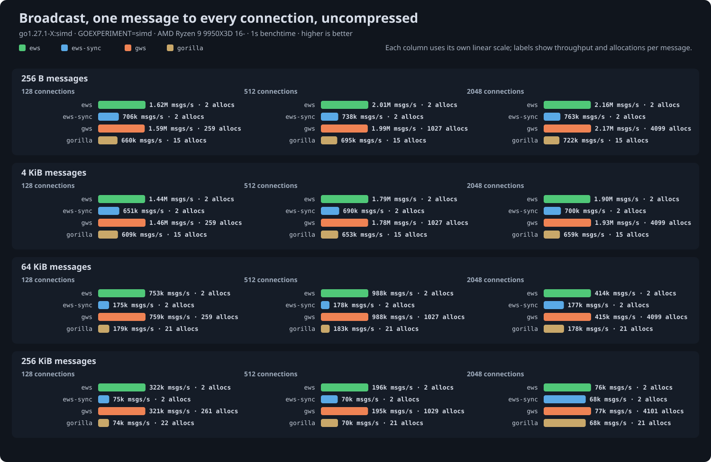
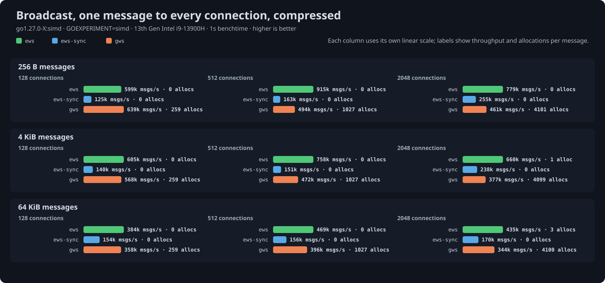
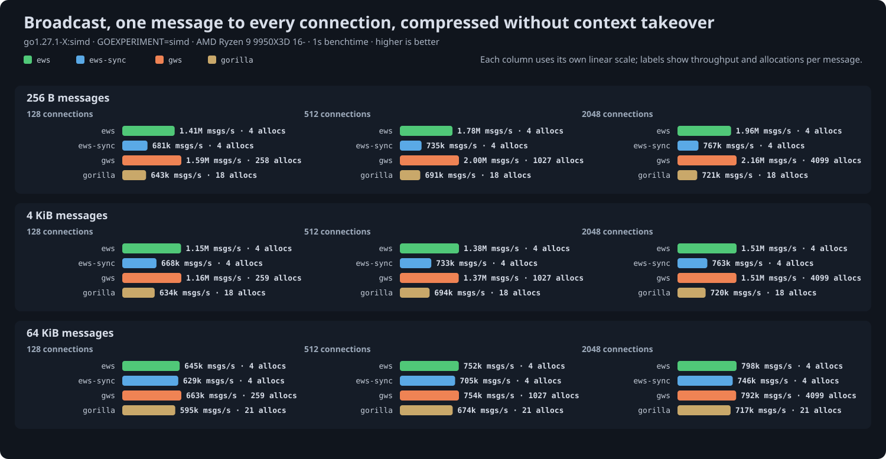

# Broadcast benchmark results

Run at ews commit `9186b3e` with `go test -run '^$' -bench Broadcast -benchtime 1s`; tables and charts generated from the saved output by `go run ../cmd/results` on 2026-09-26.

## Setup

- CPU: AMD Ryzen 9 9950X3D 16-Core Processor
- Kernel: 7.2.2-1-cachyos
- Go: go1.27.1-X:simd, `GOEXPERIMENT=simd`: SIMD masking and, on amd64, SIMD UTF-8 validation
- GOMAXPROCS: 8
- gws: v1.10.2
- coder/websocket: v1.8.15
- gorilla/websocket: v1.5.3

One message of 256 bytes, 4 KiB, 64 KiB or 256 KiB delivered to every connected client, timed until all clients have received it. Servers run behind `httptest` on loopback TCP and every client is the same ews reader, so the read side costs the same for all servers and differences come from the broadcast path. Throughput is in messages delivered per second. CPU per message is the process's user and system time over the timed rounds divided by messages delivered; it includes the clients' reads, which are the same for every server, so differences between columns are the servers'. Allocations are process-wide per round, so ews's few are the `Prepared` made once per round, not per recipient.

- `ews`: `Prepare` once, then `SendPrepared` on each connection's `Queue`, returning before the writes complete.
- `ews-sync`: `Prepare` once, then `WritePrepared` on each connection in a loop, waiting for each write.
- `gws`: `NewBroadcaster` once, then `Broadcast` on each connection through its per-connection worker.
- `gorilla`: `NewPreparedMessage` once, then `WritePreparedMessage` on each connection in a loop, waiting for each write; gorilla has no asynchronous send, so compare it with `ews-sync`. Uncompressed and no-takeover tables only, the modes gorilla supports.

Compression is permessage-deflate at flate level 1 with 15-bit windows, with and without context takeover as separate tables since they are different work; ews servers use `CompressionShared`, the mode meant for many connections. Every server reads through its own `ReadMessage`. Servers run in a seeded shuffled order within each cell and get twenty warm-up rounds before timing, since a server measured right after connecting thousands of clients read 10 to 20 percent low.

## Uncompressed

| Size | Conns | ews | ews-sync | gws | gorilla | CPU/msg ews / ews-sync / gws / gorilla | allocs/op ews / ews-sync / gws / gorilla |
|---|---|---|---|---|---|---|---|
| 256 B | 128 | 1.64M msgs/s | 705k msgs/s | 1.60M msgs/s | 661k msgs/s | 2.5 µs / 3.2 µs / 2.5 µs / 3.3 µs | 2 / 2 / 259 (9 KB) / 15 (11 KB) |
| 256 B | 512 | 2.02M msgs/s | 743k msgs/s | 2.02M msgs/s | 696k msgs/s | 2.3 µs / 3.1 µs / 2.4 µs / 3.2 µs | 2 / 2 / 1027 (36 KB) / 15 (11 KB) |
| 256 B | 2048 | 2.13M msgs/s | 765k msgs/s | 2.13M msgs/s | 717k msgs/s | 2.3 µs / 3.1 µs / 2.3 µs / 3.2 µs | 2 / 2 / 4099 (144 KB) / 15 (11 KB) |
| 256 B | 8192 | 1.70M msgs/s | 676k msgs/s | 1.70M msgs/s | 625k msgs/s | 3.1 µs / 3.4 µs / 3.1 µs / 3.5 µs | 2 / 2 / 16390 (577 KB) / 15 (11 KB) |
| 4 KiB | 128 | 1.45M msgs/s | 645k msgs/s | 1.46M msgs/s | 607k msgs/s | 2.9 µs / 3.5 µs / 2.9 µs / 3.7 µs | 2 (4 KB) / 2 (4 KB) / 259 (9 KB) / 15 (20 KB) |
| 4 KiB | 512 | 1.79M msgs/s | 689k msgs/s | 1.79M msgs/s | 644k msgs/s | 2.7 µs / 3.5 µs / 2.8 µs / 3.6 µs | 2 (4 KB) / 2 (4 KB) / 1027 (36 KB) / 15 (20 KB) |
| 4 KiB | 2048 | 1.88M msgs/s | 692k msgs/s | 1.92M msgs/s | 650k msgs/s | 2.7 µs / 3.5 µs / 2.8 µs / 3.6 µs | 2 (4 KB) / 2 (4 KB) / 4099 (144 KB) / 15 (20 KB) |
| 4 KiB | 8192 | 1.14M msgs/s | 549k msgs/s | 1.15M msgs/s | 510k msgs/s | 4.9 µs / 4.2 µs / 4.9 µs / 4.4 µs | 2 (4 KB) / 2 (4 KB) / 16387 (576 KB) / 15 (20 KB) |
| 64 KiB | 128 | 758k msgs/s | 177k msgs/s | 773k msgs/s | 174k msgs/s | 6.0 µs / 7.5 µs / 5.9 µs / 7.9 µs | 2 (72 KB) / 2 (72 KB) / 259 (9 KB) / 21 (165 KB) |
| 64 KiB | 512 | 1.01M msgs/s | 181k msgs/s | 1.01M msgs/s | 176k msgs/s | 5.1 µs / 7.3 µs / 5.1 µs / 7.4 µs | 2 (72 KB) / 2 (72 KB) / 1027 (36 KB) / 21 (164 KB) |
| 64 KiB | 2048 | 428k msgs/s | 185k msgs/s | 429k msgs/s | 189k msgs/s | 14.2 µs / 7.2 µs / 14.2 µs / 7.1 µs | 2 (72 KB) / 2 (72 KB) / 4099 (148 KB) / 21 (164 KB) |
| 64 KiB | 8192 | 266k msgs/s | 174k msgs/s | 268k msgs/s | 175k msgs/s | 24.9 µs / 7.7 µs / 24.9 µs / 7.8 µs | 2 (72 KB) / 2 (72 KB) / 16387 (581 KB) / 21 (167 KB) |
| 256 KiB | 128 | 321k msgs/s | 74k msgs/s | 320k msgs/s | 72k msgs/s | 17.0 µs / 21.4 µs / 17.2 µs / 22.7 µs | 2 (268 KB) / 2 (278 KB) / 261 (276 KB) / 21 (584 KB) |
| 256 KiB | 512 | 207k msgs/s | 71k msgs/s | 209k msgs/s | 70k msgs/s | 31.1 µs / 21.8 µs / 31.1 µs / 22.4 µs | 2 (265 KB) / 2 (267 KB) / 1029 (306 KB) / 21 (562 KB) |
| 256 KiB | 2048 | 76k msgs/s | 70k msgs/s | 77k msgs/s | 67k msgs/s | 92.9 µs / 22.2 µs / 92.4 µs / 22.9 µs | 2 (299 KB) / 2 (264 KB) / 4101 (414 KB) / 21 (561 KB) |
| 256 KiB | 8192 | 71k msgs/s | 71k msgs/s | 71k msgs/s | 68k msgs/s | 98.1 µs / 21.6 µs / 98.6 µs / 22.3 µs | 2 (264 KB) / 2 (289 KB) / 16389 (840 KB) / 21 (548 KB) |
| 2 MiB | 128 | 30k msgs/s | 10k msgs/s | 33k msgs/s | 10k msgs/s | 219.0 µs / 163.9 µs / 201.6 µs / 171.0 µs | 131 (2201 KB) / 131 (2591 KB) / 390 (2153 KB) / 151 (5065 KB) |
| 6 MiB | 128 | 3k msgs/s | 3k msgs/s | 3k msgs/s | 3k msgs/s | 2544.8 µs / 477.9 µs / 2566.6 µs / 454.4 µs | 131 (9305 KB) / 131 (7476 KB) / 389 (6164 KB) / 149 (12327 KB) |

## Compressed with context takeover

| Size | Conns | ews | ews-sync | gws | CPU/msg ews / ews-sync / gws | allocs/op ews / ews-sync / gws |
|---|---|---|---|---|---|---|
| 256 B | 128 | 1.30M msgs/s | 715k msgs/s | 1.20M msgs/s | 3.4 µs / 3.6 µs / 3.8 µs | 4 / 4 (1 KB) / 259 (9 KB) |
| 256 B | 512 | 1.59M msgs/s | 762k msgs/s | 1.47M msgs/s | 3.2 µs / 3.6 µs / 3.6 µs | 4 / 4 (3 KB) / 1027 (36 KB) |
| 256 B | 2048 | 1.48M msgs/s | 705k msgs/s | 875k msgs/s | 3.9 µs / 3.9 µs / 7.2 µs | 4 / 4 (11 KB) / 4099 (144 KB) |
| 256 B | 8192 | 1.01M msgs/s | 489k msgs/s | 784k msgs/s | 5.9 µs / 4.8 µs / 7.8 µs | 4 (10 KB) / 4 (41 KB) / 16387 (576 KB) |
| 4 KiB | 128 | 1.06M msgs/s | 715k msgs/s | 1.02M msgs/s | 4.6 µs / 4.7 µs / 5.0 µs | 4 (5 KB) / 4 (4 KB) / 259 (9 KB) |
| 4 KiB | 512 | 1.28M msgs/s | 772k msgs/s | 1.19M msgs/s | 4.4 µs / 4.7 µs / 4.8 µs | 4 (5 KB) / 4 (8 KB) / 1027 (36 KB) |
| 4 KiB | 2048 | 1.10M msgs/s | 712k msgs/s | 706k msgs/s | 5.8 µs / 5.4 µs / 9.2 µs | 4 (6 KB) / 4 (12 KB) / 4099 (144 KB) |
| 4 KiB | 8192 | 755k msgs/s | 444k msgs/s | 436k msgs/s | 8.3 µs / 7.0 µs / 14.8 µs | 4 (4 KB) / 4 (17 KB) / 16387 (576 KB) |
| 64 KiB | 128 | 641k msgs/s | 640k msgs/s | 630k msgs/s | 9.1 µs / 8.8 µs / 9.4 µs | 4 (74 KB) / 4 (73 KB) / 259 (9 KB) |
| 64 KiB | 512 | 737k msgs/s | 702k msgs/s | 713k msgs/s | 8.8 µs / 8.4 µs / 9.2 µs | 4 (74 KB) / 4 (76 KB) / 1027 (36 KB) |
| 64 KiB | 2048 | 719k msgs/s | 678k msgs/s | 480k msgs/s | 9.5 µs / 8.8 µs / 14.1 µs | 4 (72 KB) / 4 (82 KB) / 4100 (159 KB) |
| 64 KiB | 8192 | 516k msgs/s | 361k msgs/s | 349k msgs/s | 12.8 µs / 11.9 µs / 19.7 µs | 4 (83 KB) / 4 (72 KB) / 16387 (578 KB) |
| 256 KiB | 128 | 280k msgs/s | 270k msgs/s | 277k msgs/s | 23.5 µs / 23.4 µs / 24.0 µs | 4 (277 KB) / 4 (293 KB) / 261 (295 KB) |
| 256 KiB | 512 | 310k msgs/s | 303k msgs/s | 306k msgs/s | 23.1 µs / 22.7 µs / 23.5 µs | 4 (285 KB) / 4 (265 KB) / 1029 (321 KB) |
| 256 KiB | 2048 | 305k msgs/s | 309k msgs/s | 260k msgs/s | 23.8 µs / 23.1 µs / 28.0 µs | 4 (274 KB) / 4 (265 KB) / 4101 (408 KB) |
| 256 KiB | 8192 | 276k msgs/s | 293k msgs/s | 222k msgs/s | 26.3 µs / 25.0 µs / 32.4 µs | 4 (265 KB) / 4 (265 KB) / 16389 (840 KB) |
| 2 MiB | 128 | 12k msgs/s | 12k msgs/s | 12k msgs/s | 617.1 µs / 597.1 µs / 615.2 µs | 776 (2269 KB) / 774 (2583 KB) / 1030 (2124 KB) |
| 6 MiB | 128 | 15k msgs/s | 14k msgs/s | 15k msgs/s | 463.9 µs / 464.2 µs / 463.9 µs | 652 (7155 KB) / 651 (7747 KB) / 906 (8024 KB) |

## Compressed without context takeover

| Size | Conns | ews | ews-sync | gws | gorilla | CPU/msg ews / ews-sync / gws / gorilla | allocs/op ews / ews-sync / gws / gorilla |
|---|---|---|---|---|---|---|---|
| 256 B | 128 | 1.46M msgs/s | 686k msgs/s | 1.44M msgs/s | 642k msgs/s | 2.8 µs / 3.3 µs / 2.8 µs / 3.5 µs | 4 / 4 (1 KB) / 259 (9 KB) / 18 (12 KB) |
| 256 B | 512 | 1.80M msgs/s | 740k msgs/s | 1.80M msgs/s | 694k msgs/s | 2.7 µs / 3.2 µs / 2.7 µs / 3.4 µs | 4 / 4 (4 KB) / 1027 (36 KB) / 18 (14 KB) |
| 256 B | 2048 | 1.97M msgs/s | 760k msgs/s | 1.96M msgs/s | 723k msgs/s | 2.7 µs / 3.2 µs / 2.7 µs / 3.3 µs | 4 / 4 (9 KB) / 4099 (144 KB) / 18 (18 KB) |
| 256 B | 8192 | 1.62M msgs/s | 674k msgs/s | 1.63M msgs/s | 628k msgs/s | 3.3 µs / 3.5 µs / 3.3 µs / 3.7 µs | 4 (3 KB) / 4 (25 KB) / 16387 (576 KB) / 18 (29 KB) |
| 4 KiB | 128 | 1.18M msgs/s | 677k msgs/s | 1.19M msgs/s | 635k msgs/s | 4.0 µs / 4.5 µs / 4.0 µs / 4.6 µs | 4 (4 KB) / 4 (5 KB) / 259 (9 KB) / 18 (16 KB) |
| 4 KiB | 512 | 1.42M msgs/s | 741k msgs/s | 1.41M msgs/s | 696k msgs/s | 3.8 µs / 4.3 µs / 3.9 µs / 4.5 µs | 4 (5 KB) / 4 (9 KB) / 1027 (36 KB) / 18 (21 KB) |
| 4 KiB | 2048 | 1.54M msgs/s | 765k msgs/s | 1.50M msgs/s | 715k msgs/s | 3.8 µs / 4.2 µs / 3.9 µs / 4.4 µs | 4 (4 KB) / 4 (13 KB) / 4099 (145 KB) / 18 (23 KB) |
| 4 KiB | 8192 | 1.29M msgs/s | 672k msgs/s | 1.28M msgs/s | 629k msgs/s | 4.5 µs / 4.6 µs / 4.5 µs / 4.7 µs | 4 (9 KB) / 4 (13 KB) / 16387 (576 KB) / 18 (24 KB) |
| 64 KiB | 128 | 676k msgs/s | 634k msgs/s | 702k msgs/s | 582k msgs/s | 8.4 µs / 8.3 µs / 8.2 µs / 8.6 µs | 4 (74 KB) / 4 (75 KB) / 259 (9 KB) / 21 (91 KB) |
| 64 KiB | 512 | 794k msgs/s | 723k msgs/s | 796k msgs/s | 641k msgs/s | 8.1 µs / 7.9 µs / 8.1 µs / 8.0 µs | 4 (74 KB) / 4 (76 KB) / 1027 (36 KB) / 21 (93 KB) |
| 64 KiB | 2048 | 834k msgs/s | 746k msgs/s | 831k msgs/s | 689k msgs/s | 8.0 µs / 7.6 µs / 8.1 µs / 7.8 µs | 4 (75 KB) / 4 (76 KB) / 4099 (149 KB) / 21 (97 KB) |
| 64 KiB | 8192 | 740k msgs/s | 595k msgs/s | 731k msgs/s | 551k msgs/s | 8.8 µs / 8.4 µs / 8.8 µs / 8.8 µs | 4 (72 KB) / 4 (90 KB) / 16387 (576 KB) / 21 (107 KB) |
| 256 KiB | 128 | 281k msgs/s | 273k msgs/s | 288k msgs/s | 264k msgs/s | 23.1 µs / 22.7 µs / 22.9 µs / 23.0 µs | 4 (300 KB) / 5 (308 KB) / 261 (297 KB) / 22 (322 KB) |
| 256 KiB | 512 | 321k msgs/s | 314k msgs/s | 320k msgs/s | 314k msgs/s | 22.4 µs / 22.0 µs / 22.4 µs / 22.1 µs | 4 (292 KB) / 4 (285 KB) / 1036 (579 KB) / 21 (297 KB) |
| 256 KiB | 2048 | 326k msgs/s | 335k msgs/s | 332k msgs/s | 331k msgs/s | 22.4 µs / 21.7 µs / 22.2 µs / 21.8 µs | 5 (336 KB) / 4 (273 KB) / 4101 (428 KB) / 23 (395 KB) |
| 256 KiB | 8192 | 314k msgs/s | 329k msgs/s | 313k msgs/s | 330k msgs/s | 23.1 µs / 22.6 µs / 23.3 µs / 22.6 µs | 4 (265 KB) / 15 (705 KB) / 16397 (1199 KB) / 27 (514 KB) |
| 2 MiB | 128 | 13k msgs/s | 13k msgs/s | 13k msgs/s | 13k msgs/s | 569.2 µs / 565.7 µs / 565.7 µs / 562.6 µs | 783 (3690 KB) / 777 (2789 KB) / 1030 (2585 KB) / 796 (2952 KB) |
| 6 MiB | 128 | 15k msgs/s | 14k msgs/s | 15k msgs/s | 14k msgs/s | 464.6 µs / 467.5 µs / 466.9 µs / 468.1 µs | 655 (7641 KB) / 659 (9555 KB) / 908 (9060 KB) / 670 (7647 KB) |

## Reading the numbers

- Uncompressed, a round is one write per connection and one read per client, and the kernel's cost for those dominates; the asynchronous paths tie at that floor, and only the allocation counts differ.
- A synchronous loop serializes every write on one goroutine, so it trails the queued paths by several times as connections grow.
- Compressed with takeover, the message is compressed once in both libraries and only the per-connection history update and the clients' decompression remain. gws copies the payload into each connection's window in its worker; ews defers that copy until the connection next compresses a message of its own, which a broadcast-only recipient never does, so the sender's loop stays short at every payload size.
- Without takeover there is no history to update, and ews and gws tie at the write floor again; gorilla's synchronous prepared write sits with ews-sync, a little behind it on allocations.
- The CPU column separates what the throughput tie hides. Below the bandwidth ceiling the asynchronous paths cost a fifth less CPU per delivery than the synchronous ones. At the ceiling, 64 KiB and 256 KiB to 2048 clients and up, they cost two to four times more for the same throughput: thousands of writers copying at once turn memory stalls into CPU time, where one goroutine writing in turn does not. With takeover, gws's per-recipient window copy shows from 2048 clients on: at 8192 gws delivers 60 to 80 percent of ews's messages per second on 1.2 to 1.7 times the CPU per message, widest at 4 KiB.

