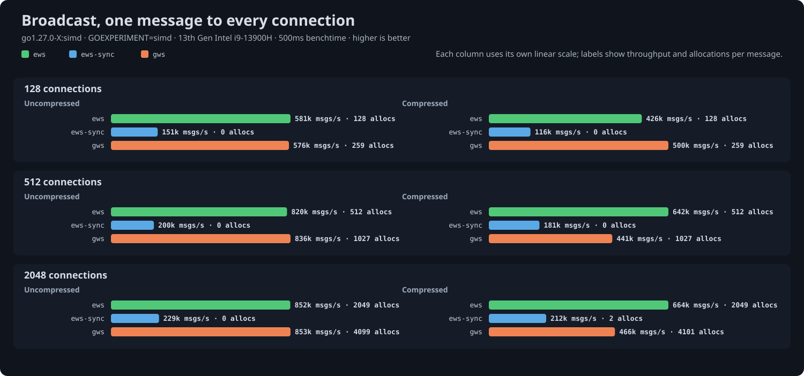

# Broadcast benchmark results

Generated 2026-09-14 from `go test -run '^$' -bench Broadcast -benchtime 1s | go run ../cmd/results` at ews commit `9965877`.

## Setup

- CPU: 13th Gen Intel(R) Core(TM) i9-13900H
- Kernel: 6.12.0-211.53.1.el10_2.x86_64
- Go: go1.27.0-X:simd, `GOEXPERIMENT=simd`: SIMD masking and, on amd64, SIMD UTF-8 validation
- gws: v1.10.2
- coder/websocket: v1.8.15

One 256-byte message delivered to every connected client, timed until all clients have received it. Servers run behind `httptest` on loopback TCP and every client is the same ews reader, so the read side costs the same for all servers and differences come from the broadcast path. Throughput is in messages delivered per second; allocations are process-wide per round.

- `ews`: `Prepare` once, then `SendPrepared` on each connection's `Queue`, returning before the writes complete.
- `ews-sync`: `Prepare` once, then `WritePrepared` on each connection in a loop, waiting for each write.
- `gws`: `NewBroadcaster` once, then `Broadcast` on each connection through its per-connection worker.

Compression is permessage-deflate with context takeover, flate level 1 and 15-bit windows on both libraries; ews servers use `CompressionShared`, the mode meant for many connections. Every server reads through its own `ReadMessage`. Servers run in a seeded shuffled order within each cell and get twenty warm-up rounds before timing, since a server measured right after connecting thousands of clients read 10 to 20 percent low.

## Uncompressed

| Conns | ews | ews-sync | gws | allocs/op ews / ews-sync / gws |
|---|---|---|---|---|
| 128 | 962k msgs/s | 165k msgs/s | 905k msgs/s | 0 / 0 / 259 (9 KB) |
| 512 | 1.18M msgs/s | 232k msgs/s | 792k msgs/s | 0 / 0 / 1027 (36 KB) |
| 2048 | 1.27M msgs/s | 262k msgs/s | 1.28M msgs/s | 2 / 0 / 4100 (145 KB) |

## Compressed

| Conns | ews | ews-sync | gws | allocs/op ews / ews-sync / gws |
|---|---|---|---|---|
| 128 | 594k msgs/s | 114k msgs/s | 634k msgs/s | 0 (1 KB) / 0 (9 KB) / 259 (9 KB) |
| 512 | 888k msgs/s | 150k msgs/s | 505k msgs/s | 0 / 0 / 1027 (36 KB) |
| 2048 | 741k msgs/s | 248k msgs/s | 446k msgs/s | 0 / 1 (70 KB) / 4099 (144 KB) |

## Reading the numbers

- Uncompressed, a round is one write per connection and one read per client, and the kernel's cost for those dominates; the asynchronous paths tie at that floor, and only the allocation counts differ.
- A synchronous loop serializes every write on one goroutine, so it trails the queued paths by several times as connections grow.
- Compressed, the message is compressed once in both libraries and only the per-connection history update and the clients' decompression remain; ews's amortized window update keeps that cheap.

