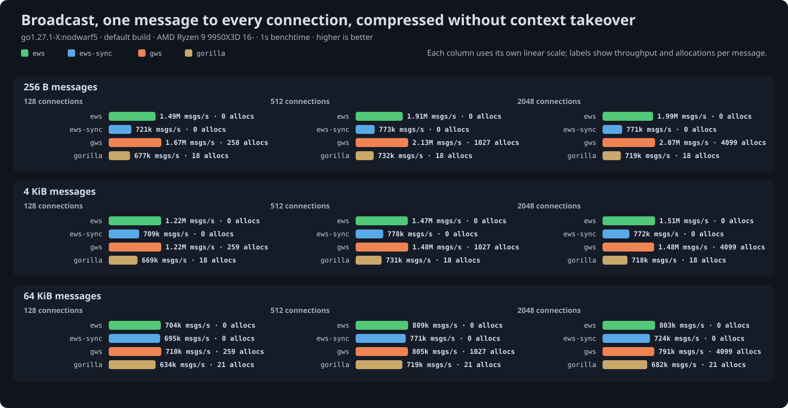

# Broadcast benchmark results

Generated 2026-09-17 from `go test -run '^$' -bench Broadcast -benchtime 1s | go run ../cmd/results` at ews commit `622145e`.

## Setup

- CPU: AMD Ryzen 9 9950X3D 16-Core Processor
- Kernel: 7.2.2-1-cachyos
- Go: go1.27.1-X:nodwarf5, default build: SWAR masking and the shift-based UTF-8 validator
- GOMAXPROCS: 32
- gws: v1.10.2
- coder/websocket: v1.8.15
- gorilla/websocket: v1.5.3

One message of 256 bytes, 4 KiB, 64 KiB or 256 KiB delivered to every connected client, timed until all clients have received it. Servers run behind `httptest` on loopback TCP and every client is the same ews reader, so the read side costs the same for all servers and differences come from the broadcast path. Throughput is in messages delivered per second. CPU per message is the process's user and system time over the timed rounds divided by messages delivered; it includes the clients' reads, which are the same for every server, so differences between columns are the servers'. Allocations are process-wide per round, so ews's few are the `Prepared` made once per round, not per recipient.

- `ews`: `Prepare` once, then `SendPrepared` on each connection's `Queue`, returning before the writes complete.
- `ews-sync`: `Prepare` once, then `WritePrepared` on each connection in a loop, waiting for each write.
- `gws`: `NewBroadcaster` once, then `Broadcast` on each connection through its per-connection worker.
- `gorilla`: `NewPreparedMessage` once, then `WritePreparedMessage` on each connection in a loop, waiting for each write; gorilla has no asynchronous send, so compare it with `ews-sync`. Uncompressed and no-takeover tables only, the modes gorilla supports.

Compression is permessage-deflate at flate level 1 with 15-bit windows, with and without context takeover as separate tables since they are different work; ews servers use `CompressionShared`, the mode meant for many connections. Every server reads through its own `ReadMessage`. Servers run in a seeded shuffled order within each cell and get twenty warm-up rounds before timing, since a server measured right after connecting thousands of clients read 10 to 20 percent low.

## Uncompressed

| Size | Conns | ews | ews-sync | gws | gorilla | CPU/msg ews / ews-sync / gws / gorilla | allocs/op ews / ews-sync / gws / gorilla |
|---|---|---|---|---|---|---|---|
| 256 B | 128 | 1.62M msgs/s | 710k msgs/s | 1.60M msgs/s | 668k msgs/s | 2.5 µs / 3.1 µs / 2.5 µs / 3.3 µs | 2 / 2 / 259 (9 KB) / 15 (11 KB) |
| 256 B | 512 | 2.04M msgs/s | 740k msgs/s | 2.02M msgs/s | 697k msgs/s | 2.3 µs / 3.1 µs / 2.4 µs / 3.2 µs | 2 / 2 / 1027 (36 KB) / 15 (11 KB) |
| 256 B | 2048 | 2.16M msgs/s | 765k msgs/s | 2.19M msgs/s | 720k msgs/s | 2.4 µs / 3.1 µs / 2.3 µs / 3.2 µs | 2 / 2 / 4099 (144 KB) / 15 (11 KB) |
| 4 KiB | 128 | 1.47M msgs/s | 654k msgs/s | 1.46M msgs/s | 611k msgs/s | 2.9 µs / 3.5 µs / 2.9 µs / 3.7 µs | 2 (4 KB) / 2 (4 KB) / 259 (9 KB) / 15 (20 KB) |
| 4 KiB | 512 | 1.79M msgs/s | 692k msgs/s | 1.79M msgs/s | 653k msgs/s | 2.7 µs / 3.4 µs / 2.7 µs / 3.6 µs | 2 (4 KB) / 2 (4 KB) / 1027 (36 KB) / 15 (20 KB) |
| 4 KiB | 2048 | 1.92M msgs/s | 700k msgs/s | 1.91M msgs/s | 660k msgs/s | 2.7 µs / 3.4 µs / 2.8 µs / 3.6 µs | 2 (4 KB) / 2 (4 KB) / 4099 (144 KB) / 15 (20 KB) |
| 64 KiB | 128 | 753k msgs/s | 177k msgs/s | 764k msgs/s | 176k msgs/s | 6.0 µs / 7.5 µs / 5.9 µs / 7.7 µs | 2 (73 KB) / 2 (73 KB) / 259 (9 KB) / 21 (166 KB) |
| 64 KiB | 512 | 1.00M msgs/s | 194k msgs/s | 994k msgs/s | 185k msgs/s | 5.2 µs / 7.1 µs / 5.2 µs / 7.3 µs | 2 (72 KB) / 2 (72 KB) / 1027 (36 KB) / 21 (165 KB) |
| 64 KiB | 2048 | 419k msgs/s | 182k msgs/s | 419k msgs/s | 197k msgs/s | 14.6 µs / 7.3 µs / 14.6 µs / 7.0 µs | 2 (72 KB) / 2 (72 KB) / 4099 (147 KB) / 21 (165 KB) |
| 256 KiB | 128 | 322k msgs/s | 76k msgs/s | 321k msgs/s | 74k msgs/s | 16.8 µs / 20.8 µs / 16.9 µs / 21.8 µs | 2 (272 KB) / 2 (289 KB) / 261 (281 KB) / 22 (612 KB) |
| 256 KiB | 512 | 191k msgs/s | 72k msgs/s | 193k msgs/s | 72k msgs/s | 34.0 µs / 21.7 µs / 33.7 µs / 21.7 µs | 2 (267 KB) / 2 (271 KB) / 1029 (303 KB) / 21 (568 KB) |
| 256 KiB | 2048 | 77k msgs/s | 70k msgs/s | 77k msgs/s | 70k msgs/s | 93.0 µs / 22.0 µs / 92.8 µs / 22.0 µs | 2 (264 KB) / 2 (264 KB) / 4101 (408 KB) / 21 (555 KB) |

## Compressed with context takeover

| Size | Conns | ews | ews-sync | gws | CPU/msg ews / ews-sync / gws | allocs/op ews / ews-sync / gws |
|---|---|---|---|---|---|---|
| 256 B | 128 | 1.26M msgs/s | 703k msgs/s | 1.18M msgs/s | 3.5 µs / 3.8 µs / 3.9 µs | 4 / 4 / 259 (9 KB) |
| 256 B | 512 | 1.55M msgs/s | 751k msgs/s | 1.45M msgs/s | 3.3 µs / 3.8 µs / 3.7 µs | 4 / 4 (3 KB) / 1027 (36 KB) |
| 256 B | 2048 | 1.47M msgs/s | 701k msgs/s | 851k msgs/s | 4.0 µs / 3.9 µs / 7.3 µs | 4 (1 KB) / 4 (11 KB) / 4099 (144 KB) |
| 4 KiB | 128 | 1.04M msgs/s | 695k msgs/s | 985k msgs/s | 4.8 µs / 4.9 µs / 5.1 µs | 4 (5 KB) / 4 (4 KB) / 259 (9 KB) |
| 4 KiB | 512 | 1.23M msgs/s | 756k msgs/s | 1.16M msgs/s | 4.6 µs / 5.0 µs / 4.9 µs | 4 (5 KB) / 4 (7 KB) / 1027 (36 KB) |
| 4 KiB | 2048 | 1.09M msgs/s | 689k msgs/s | 701k msgs/s | 5.8 µs / 5.6 µs / 9.2 µs | 4 (6 KB) / 4 (10 KB) / 4099 (144 KB) |
| 64 KiB | 128 | 599k msgs/s | 619k msgs/s | 589k msgs/s | 9.6 µs / 9.3 µs / 10.0 µs | 4 (81 KB) / 4 (76 KB) / 259 (9 KB) |
| 64 KiB | 512 | 703k msgs/s | 705k msgs/s | 682k msgs/s | 9.3 µs / 8.9 µs / 9.7 µs | 4 (74 KB) / 4 (76 KB) / 1027 (36 KB) |
| 64 KiB | 2048 | 684k msgs/s | 656k msgs/s | 465k msgs/s | 10.0 µs / 9.2 µs / 14.7 µs | 4 (74 KB) / 4 (76 KB) / 4099 (144 KB) |
| 256 KiB | 128 | 255k msgs/s | 246k msgs/s | 256k msgs/s | 25.7 µs / 25.4 µs / 25.9 µs | 6 (396 KB) / 6 (400 KB) / 261 (316 KB) |
| 256 KiB | 512 | 289k msgs/s | 283k msgs/s | 285k msgs/s | 24.9 µs / 24.6 µs / 25.3 µs | 4 (286 KB) / 5 (349 KB) / 1029 (314 KB) |
| 256 KiB | 2048 | 284k msgs/s | 288k msgs/s | 240k msgs/s | 25.6 µs / 25.1 µs / 29.9 µs | 4 (274 KB) / 4 (269 KB) / 4101 (408 KB) |

## Compressed without context takeover

| Size | Conns | ews | ews-sync | gws | gorilla | CPU/msg ews / ews-sync / gws / gorilla | allocs/op ews / ews-sync / gws / gorilla |
|---|---|---|---|---|---|---|---|
| 256 B | 128 | 1.41M msgs/s | 686k msgs/s | 1.41M msgs/s | 642k msgs/s | 2.9 µs / 3.3 µs / 2.9 µs / 3.5 µs | 4 / 4 / 259 (9 KB) / 18 (12 KB) |
| 256 B | 512 | 1.79M msgs/s | 737k msgs/s | 1.78M msgs/s | 694k msgs/s | 2.7 µs / 3.2 µs / 2.7 µs / 3.4 µs | 4 / 4 (5 KB) / 1027 (36 KB) / 18 (16 KB) |
| 256 B | 2048 | 1.95M msgs/s | 772k msgs/s | 1.95M msgs/s | 723k msgs/s | 2.7 µs / 3.1 µs / 2.7 µs / 3.3 µs | 4 (1 KB) / 4 (5 KB) / 4099 (144 KB) / 18 (21 KB) |
| 4 KiB | 128 | 1.13M msgs/s | 668k msgs/s | 1.14M msgs/s | 628k msgs/s | 4.1 µs / 4.6 µs / 4.1 µs / 4.7 µs | 4 (5 KB) / 4 (5 KB) / 259 (9 KB) / 18 (16 KB) |
| 4 KiB | 512 | 1.36M msgs/s | 736k msgs/s | 1.35M msgs/s | 691k msgs/s | 4.0 µs / 4.4 µs / 4.0 µs / 4.5 µs | 4 (5 KB) / 4 (7 KB) / 1027 (36 KB) / 18 (21 KB) |
| 4 KiB | 2048 | 1.48M msgs/s | 768k msgs/s | 1.47M msgs/s | 718k msgs/s | 4.0 µs / 4.2 µs / 4.0 µs / 4.4 µs | 4 (5 KB) / 4 (12 KB) / 4099 (145 KB) / 18 (25 KB) |
| 64 KiB | 128 | 637k msgs/s | 621k msgs/s | 654k msgs/s | 585k msgs/s | 8.9 µs / 8.7 µs / 8.7 µs / 8.9 µs | 4 (75 KB) / 4 (75 KB) / 259 (9 KB) / 21 (94 KB) |
| 64 KiB | 512 | 743k msgs/s | 710k msgs/s | 758k msgs/s | 677k msgs/s | 8.6 µs / 8.3 µs / 8.5 µs / 8.4 µs | 4 (97 KB) / 4 (75 KB) / 1027 (37 KB) / 21 (92 KB) |
| 64 KiB | 2048 | 793k msgs/s | 741k msgs/s | 788k msgs/s | 712k msgs/s | 8.5 µs / 8.1 µs / 8.5 µs / 8.2 µs | 4 (80 KB) / 4 (77 KB) / 4099 (148 KB) / 21 (109 KB) |
| 256 KiB | 128 | 256k msgs/s | 248k msgs/s | 264k msgs/s | 245k msgs/s | 25.2 µs / 24.8 µs / 24.8 µs / 24.9 µs | 8 (536 KB) / 8 (523 KB) / 262 (394 KB) / 23 (420 KB) |
| 256 KiB | 512 | 297k msgs/s | 285k msgs/s | 298k msgs/s | 286k msgs/s | 24.2 µs / 24.0 µs / 24.2 µs / 24.1 µs | 4 (320 KB) / 10 (733 KB) / 1030 (387 KB) / 24 (535 KB) |
| 256 KiB | 2048 | 303k msgs/s | 308k msgs/s | 305k msgs/s | 303k msgs/s | 24.0 µs / 23.6 µs / 24.0 µs / 23.9 µs | 6 (412 KB) / 6 (418 KB) / 4102 (541 KB) / 25 (599 KB) |

## Reading the numbers

- Uncompressed, a round is one write per connection and one read per client, and the kernel's cost for those dominates; the asynchronous paths tie at that floor, and only the allocation counts differ.
- A synchronous loop serializes every write on one goroutine, so it trails the queued paths by several times as connections grow.
- Compressed with takeover, the message is compressed once in both libraries and only the per-connection history update and the clients' decompression remain. gws copies the payload into each connection's window in its worker; ews defers that copy until the connection next compresses a message of its own, which a broadcast-only recipient never does, so the sender's loop stays short at every payload size.
- Without takeover there is no history to update, and ews and gws tie at the write floor again; gorilla's synchronous prepared write sits with ews-sync, a little behind it on allocations.
- The CPU column separates what the throughput tie hides. Below the bandwidth ceiling the asynchronous paths cost a fifth less CPU per delivery than the synchronous ones. At the ceiling, 64 KiB and 256 KiB to 2048 clients, they cost two to four times more for the same throughput: two thousand writers copying at once turn memory stalls into CPU time, where one goroutine writing in turn does not. With takeover, gws's per-recipient window copy shows as up to 1.8 times ews's CPU per message at 2048 clients.

