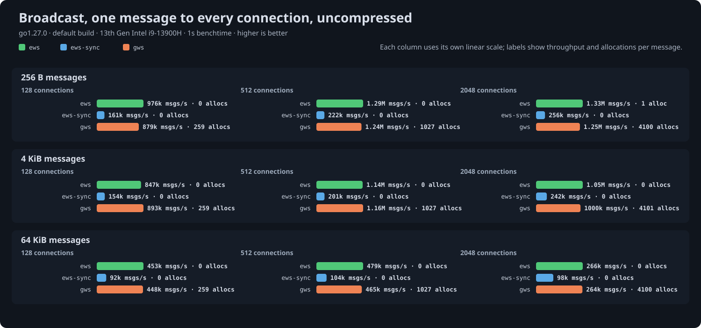

# Broadcast benchmark results

Generated 2026-09-14 from `go test -run '^$' -bench Broadcast -benchtime 1s | go run ../cmd/results` at ews commit `32177d3`.

## Setup

- CPU: 13th Gen Intel(R) Core(TM) i9-13900H
- Kernel: 6.12.0-211.53.1.el10_2.x86_64
- Go: go1.27.0, default build: SWAR masking and the shift-based UTF-8 validator
- gws: v1.10.2
- coder/websocket: v1.8.15

One message of 256 bytes, 4 KiB or 64 KiB delivered to every connected client, timed until all clients have received it. Servers run behind `httptest` on loopback TCP and every client is the same ews reader, so the read side costs the same for all servers and differences come from the broadcast path. Throughput is in messages delivered per second; allocations are process-wide per round.

- `ews`: `Prepare` once, then `SendPrepared` on each connection's `Queue`, returning before the writes complete.
- `ews-sync`: `Prepare` once, then `WritePrepared` on each connection in a loop, waiting for each write.
- `gws`: `NewBroadcaster` once, then `Broadcast` on each connection through its per-connection worker.

Compression is permessage-deflate with context takeover, flate level 1 and 15-bit windows on both libraries; ews servers use `CompressionShared`, the mode meant for many connections. Every server reads through its own `ReadMessage`. Servers run in a seeded shuffled order within each cell and get twenty warm-up rounds before timing, since a server measured right after connecting thousands of clients read 10 to 20 percent low.

## Uncompressed

| Size | Conns | ews | ews-sync | gws | allocs/op ews / ews-sync / gws |
|---|---|---|---|---|---|
| 256 B | 128 | 976k msgs/s | 161k msgs/s | 879k msgs/s | 0 / 0 / 259 (9 KB) |
| 256 B | 512 | 1.29M msgs/s | 222k msgs/s | 1.24M msgs/s | 0 / 0 / 1027 (36 KB) |
| 256 B | 2048 | 1.33M msgs/s | 256k msgs/s | 1.25M msgs/s | 1 / 0 / 4100 (144 KB) |
| 4 KiB | 128 | 847k msgs/s | 154k msgs/s | 893k msgs/s | 0 / 0 / 259 (9 KB) |
| 4 KiB | 512 | 1.14M msgs/s | 201k msgs/s | 1.16M msgs/s | 0 / 0 / 1027 (36 KB) |
| 4 KiB | 2048 | 1.05M msgs/s | 242k msgs/s | 1000k msgs/s | 0 / 0 / 4101 (145 KB) |
| 64 KiB | 128 | 453k msgs/s | 92k msgs/s | 448k msgs/s | 0 / 0 / 259 (9 KB) |
| 64 KiB | 512 | 479k msgs/s | 104k msgs/s | 465k msgs/s | 0 / 0 (2 KB) / 1027 (36 KB) |
| 64 KiB | 2048 | 266k msgs/s | 98k msgs/s | 264k msgs/s | 0 (1 KB) / 0 (2 KB) / 4100 (148 KB) |

## Compressed

| Size | Conns | ews | ews-sync | gws | allocs/op ews / ews-sync / gws |
|---|---|---|---|---|---|
| 256 B | 128 | 613k msgs/s | 122k msgs/s | 642k msgs/s | 0 / 0 / 259 (9 KB) |
| 256 B | 512 | 858k msgs/s | 165k msgs/s | 491k msgs/s | 0 / 0 (25 KB) / 1027 (36 KB) |
| 256 B | 2048 | 762k msgs/s | 245k msgs/s | 435k msgs/s | 0 (12 KB) / 0 / 4101 (145 KB) |
| 4 KiB | 128 | 595k msgs/s | 175k msgs/s | 539k msgs/s | 0 / 0 (4 KB) / 259 (9 KB) |
| 4 KiB | 512 | 733k msgs/s | 170k msgs/s | 428k msgs/s | 0 (3 KB) / 0 / 1027 (36 KB) |
| 4 KiB | 2048 | 640k msgs/s | 244k msgs/s | 310k msgs/s | 0 (17 KB) / 0 / 4104 (146 KB) |
| 64 KiB | 128 | 386k msgs/s | 147k msgs/s | 352k msgs/s | 0 (1 KB) / 0 (5 KB) / 259 (9 KB) |
| 64 KiB | 512 | 465k msgs/s | 156k msgs/s | 385k msgs/s | 0 / 0 (23 KB) / 1027 (37 KB) |
| 64 KiB | 2048 | 424k msgs/s | 148k msgs/s | 321k msgs/s | 2 (29 KB) / 0 (4 KB) / 4103 (154 KB) |

## Reading the numbers

- Uncompressed, a round is one write per connection and one read per client, and the kernel's cost for those dominates; the asynchronous paths tie at that floor, and only the allocation counts differ.
- A synchronous loop serializes every write on one goroutine, so it trails the queued paths by several times as connections grow.
- Compressed, the message is compressed once in both libraries and only the per-connection history update and the clients' decompression remain. gws copies the payload into each connection's window in its worker; ews defers that copy until the connection next compresses a message of its own, which a broadcast-only recipient never does, so the sender's loop stays short at every payload size.

