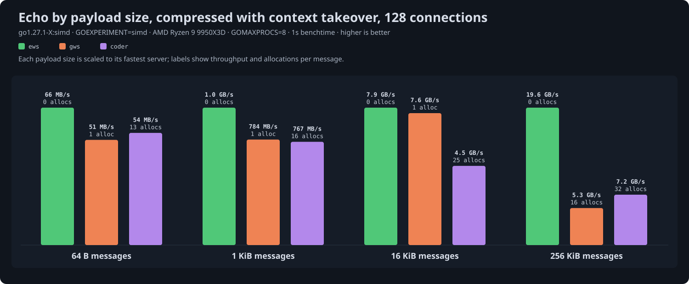
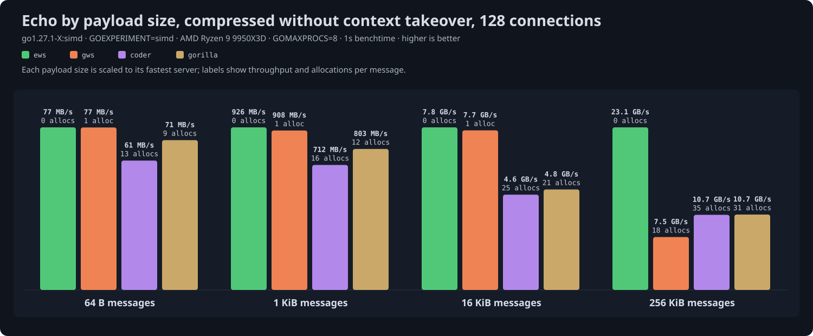
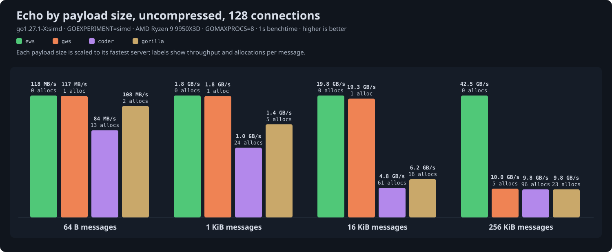
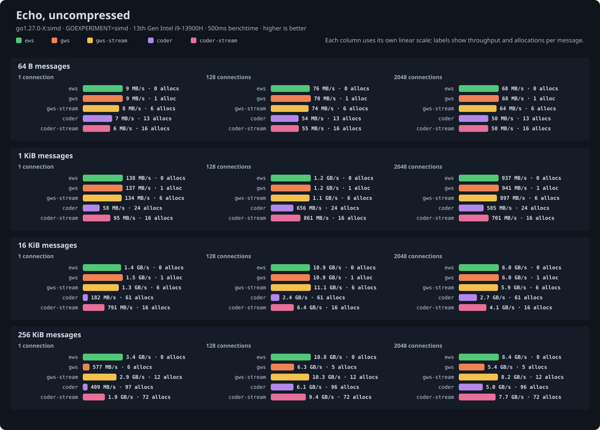
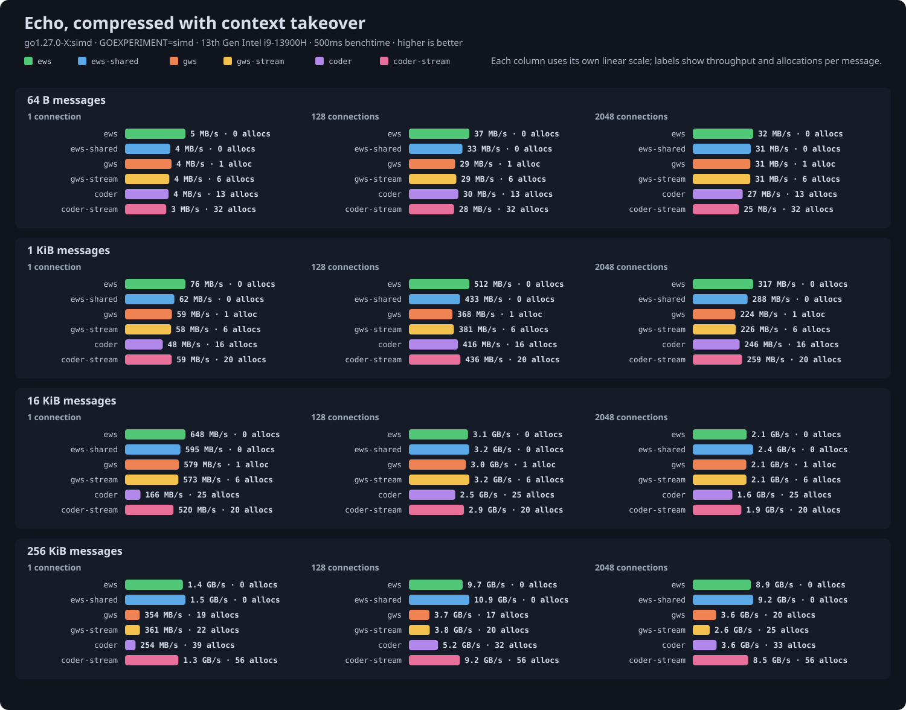
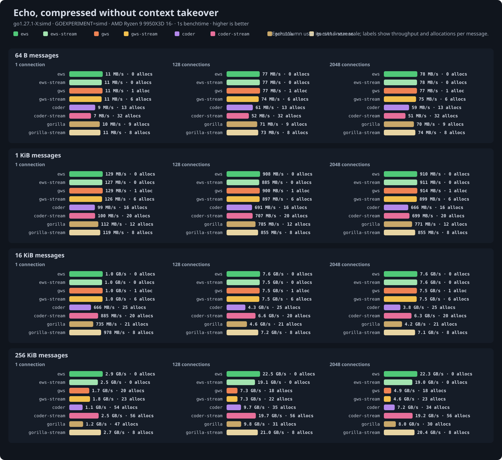

# Echo benchmark results

Run at ews commit `5387555` with `go test -run '^$' -bench Echo -benchtime 1s`; tables and charts generated from the saved output by `go run ../cmd/results` on 2026-09-26.

## Setup

- CPU: AMD Ryzen 9 9950X3D 16-Core Processor
- Kernel: 7.2.2-1-cachyos
- Go: go1.27.1-X:simd, `GOEXPERIMENT=simd`: SIMD masking and, on amd64, SIMD UTF-8 validation
- GOMAXPROCS: 8
- gws: v1.10.2
- coder/websocket: v1.8.15
- gorilla/websocket: v1.5.3

Echo servers behind `httptest` on loopback TCP, all driven by the same ews client, one ping-pong at a time per connection. Throughput counts payload bytes in one direction per round trip. Allocations are process-wide per message; the ews client allocates nothing, so they are effectively the server's.

- `ews`: `ws.Conn` with `ReadMessage` and `Write`, default 4 KiB read buffer. With compression it keeps a compressor attached per connection.
- `ews-shared`: the same with `CompressionShared`, borrowing a pooled compressor per message as gws and coder do. Takeover table only; it is identical to `ews` otherwise.
- `ews-stream`: `NextMessage` then `WriteFrom` reading the connection itself, so no message is held whole and compressed input is inflated as its frames arrive. Messages above `FragmentSize` (64 KiB) go out as several frames, each compressed chunk flushed on its own, and each chunk is copied out of the read buffer, which is what separates it from `ews` at 256 KiB. This is ews's streaming shape, against `gws-stream` and `coder-stream`.
- `ews-events`: the same echo as an `events.Handler` behind `events.HTTP`, one method per event, against `gws-events`.
- `gws`: gws's `ReadMessage` and `WriteMessage` in a loop, the like-for-like shape against ews. Its event-driven `ReadLoop` shares the frame path and measured the same within noise.
- `gws-stream`: gws's `NextReader` piped into `WriteFile`, so no message is held whole.
- `gws-events`: gws's `ReadLoop` driving an `OnMessage` handler that writes the message back, the shape gws documents.
- `coder`: coder/websocket with `Read` and `Write` in a loop.
- `coder-stream`: coder/websocket piping `Reader` into `Writer` through a reusable buffer, so no message is held whole.
- `gorilla`: gorilla/websocket with `ReadMessage` and `WriteMessage` in a loop. Uncompressed and no-takeover tables only, since gorilla negotiates only `no_context_takeover`.
- `gorilla-stream`: gorilla/websocket piping `NextReader` into `NextWriter` through a reusable buffer.

Compression is permessage-deflate at flate level 1, every message compressed, in two modes that are separate tables because they are different work. With context takeover each direction keeps a 32 KB history that every message extends, so the inflater is primed with a dictionary per message and both ends copy history; it compresses real traffic far better. Without takeover each message is compressed on its own. gws is configured for 15-bit windows to match the 32 KB window ews uses, since its default is 12 bits. coder/websocket uses its fixed level and pooled flate readers and writers, with its compression threshold lowered so that, like the others, it compresses every message. gorilla/websocket uses the standard library's flate. Compressed payloads are repeated JSON-like text; uncompressed payloads are random bytes.

Single-connection small-message cells are dominated by loopback round-trip latency and vary more between runs than large-message and allocation figures. Beyond the machine's thread count, more connections measure scheduling and per-connection overhead rather than parallelism.

## Uncompressed

| Size | Conns | ews | ews-stream | ews-events | gws | gws-stream | gws-events | coder | coder-stream | gorilla | gorilla-stream | allocs/op ews / ews-stream / ews-events / gws / gws-stream / gws-events / coder / coder-stream / gorilla / gorilla-stream |
|---|---|---|---|---|---|---|---|---|---|---|---|---|
| 64 B | 1 | 18 MB/s | 18 MB/s | 18 MB/s | 18 MB/s | 18 MB/s | 19 MB/s | 14 MB/s | 13 MB/s | 18 MB/s | 18 MB/s | 0 / 0 / 0 / 1 / 6 / 1 / 13 / 16 / 2 / 2 |
| 64 B | 32 | 108 MB/s | 107 MB/s | 106 MB/s | 106 MB/s | 104 MB/s | 106 MB/s | 80 MB/s | 81 MB/s | 101 MB/s | 104 MB/s | 0 / 0 / 0 / 1 / 6 / 1 / 13 / 16 / 2 / 2 |
| 64 B | 128 | 118 MB/s | 117 MB/s | 116 MB/s | 118 MB/s | 114 MB/s | 118 MB/s | 85 MB/s | 85 MB/s | 107 MB/s | 116 MB/s | 0 / 0 / 0 / 1 / 6 / 1 / 13 / 16 / 2 / 2 |
| 64 B | 512 | 120 MB/s | 118 MB/s | 118 MB/s | 120 MB/s | 115 MB/s | 119 MB/s | 89 MB/s | 87 MB/s | 112 MB/s | 117 MB/s | 0 / 0 / 0 / 1 / 6 / 1 / 13 / 16 / 2 / 2 |
| 64 B | 1024 | 121 MB/s | 119 MB/s | 119 MB/s | 120 MB/s | 116 MB/s | 119 MB/s | 90 MB/s | 87 MB/s | 114 MB/s | 118 MB/s | 0 / 0 / 0 / 1 / 6 / 1 / 13 / 16 / 2 / 2 |
| 64 B | 2048 | 120 MB/s | 118 MB/s | 119 MB/s | 119 MB/s | 114 MB/s | 119 MB/s | 88 MB/s | 85 MB/s | 113 MB/s | 118 MB/s | 0 / 0 / 0 / 1 / 6 / 1 / 13 / 16 / 2 / 2 |
| 1 KiB | 1 | 287 MB/s | 284 MB/s | 284 MB/s | 281 MB/s | 273 MB/s | 281 MB/s | 177 MB/s | 195 MB/s | 243 MB/s | 278 MB/s | 0 / 0 / 0 / 1 / 6 / 1 / 24 (2 KB) / 16 / 5 (2 KB) / 2 |
| 1 KiB | 32 | 1.7 GB/s | 1.6 GB/s | 1.6 GB/s | 1.6 GB/s | 1.6 GB/s | 1.6 GB/s | 965 MB/s | 1.2 GB/s | 1.3 GB/s | 1.6 GB/s | 0 / 0 / 0 / 1 / 6 / 1 / 24 (2 KB) / 16 / 5 (2 KB) / 2 |
| 1 KiB | 128 | 1.8 GB/s | 1.8 GB/s | 1.8 GB/s | 1.8 GB/s | 1.7 GB/s | 1.8 GB/s | 1.0 GB/s | 1.3 GB/s | 1.4 GB/s | 1.8 GB/s | 0 / 0 / 0 / 1 / 6 / 1 / 24 (2 KB) / 16 / 5 (2 KB) / 2 |
| 1 KiB | 512 | 1.9 GB/s | 1.8 GB/s | 1.8 GB/s | 1.8 GB/s | 1.8 GB/s | 1.8 GB/s | 1.1 GB/s | 1.3 GB/s | 1.5 GB/s | 1.8 GB/s | 0 / 0 / 0 / 1 / 6 / 1 / 24 (2 KB) / 16 / 5 (2 KB) / 2 |
| 1 KiB | 1024 | 1.9 GB/s | 1.8 GB/s | 1.8 GB/s | 1.8 GB/s | 1.8 GB/s | 1.8 GB/s | 1.1 GB/s | 1.3 GB/s | 1.5 GB/s | 1.8 GB/s | 0 / 0 / 0 / 1 / 6 / 1 / 24 (2 KB) / 16 / 5 (2 KB) / 2 |
| 1 KiB | 2048 | 1.9 GB/s | 1.8 GB/s | 1.8 GB/s | 1.8 GB/s | 1.8 GB/s | 1.8 GB/s | 1.1 GB/s | 1.3 GB/s | 1.5 GB/s | 1.8 GB/s | 0 / 0 / 0 / 1 / 6 / 1 / 24 (2 KB) / 16 / 5 (2 KB) / 2 |
| 16 KiB | 1 | 3.0 GB/s | 3.0 GB/s | 3.0 GB/s | 3.0 GB/s | 3.0 GB/s | 3.0 GB/s | 1.0 GB/s | 1.6 GB/s | 1.5 GB/s | 1.3 GB/s | 0 / 0 / 0 / 1 / 6 / 1 / 61 (40 KB) / 16 / 16 (38 KB) / 2 |
| 16 KiB | 32 | 18.9 GB/s | 18.9 GB/s | 18.9 GB/s | 18.5 GB/s | 18.3 GB/s | 18.3 GB/s | 4.0 GB/s | 10.3 GB/s | 5.3 GB/s | 8.5 GB/s | 0 / 0 / 0 / 1 / 6 / 1 / 61 (39 KB) / 16 / 16 (37 KB) / 2 |
| 16 KiB | 128 | 19.5 GB/s | 19.6 GB/s | 19.5 GB/s | 19.4 GB/s | 19.2 GB/s | 19.4 GB/s | 4.9 GB/s | 10.8 GB/s | 6.3 GB/s | 9.0 GB/s | 0 / 0 / 0 / 1 / 6 / 1 / 61 (38 KB) / 16 / 16 (37 KB) / 2 |
| 16 KiB | 512 | 20.0 GB/s | 20.1 GB/s | 20.1 GB/s | 19.8 GB/s | 19.6 GB/s | 19.9 GB/s | 5.3 GB/s | 10.9 GB/s | 7.0 GB/s | 9.2 GB/s | 0 / 0 / 0 / 1 / 6 / 1 / 61 (38 KB) / 16 / 16 (37 KB) / 2 |
| 16 KiB | 1024 | 19.8 GB/s | 19.5 GB/s | 19.4 GB/s | 19.4 GB/s | 19.1 GB/s | 19.3 GB/s | 4.8 GB/s | 10.0 GB/s | 6.2 GB/s | 9.0 GB/s | 0 / 0 / 0 / 1 / 6 / 1 / 61 (38 KB) / 16 / 16 (37 KB) / 2 |
| 16 KiB | 2048 | 14.0 GB/s | 13.6 GB/s | 13.7 GB/s | 14.0 GB/s | 13.5 GB/s | 13.9 GB/s | 3.7 GB/s | 6.9 GB/s | 4.5 GB/s | 7.4 GB/s | 0 / 0 / 0 / 1 / 6 / 1 / 61 (38 KB) / 16 / 16 (37 KB) / 2 |
| 256 KiB | 1 | 6.9 GB/s | 6.0 GB/s | 7.3 GB/s | 3.7 GB/s | 6.3 GB/s | 3.7 GB/s | 2.8 GB/s | 4.0 GB/s | 2.9 GB/s | 1.8 GB/s | 0 / 0 / 0 / 5 (600 KB) / 12 / 5 (602 KB) / 97 (716 KB) / 72 (3 KB) / 24 (716 KB) / 2 |
| 256 KiB | 32 | 43.4 GB/s | 36.3 GB/s | 43.3 GB/s | 13.9 GB/s | 36.5 GB/s | 13.8 GB/s | 12.4 GB/s | 25.2 GB/s | 12.9 GB/s | 12.9 GB/s | 0 / 0 / 0 / 5 (536 KB) / 12 / 5 (536 KB) / 96 (630 KB) / 72 (2 KB) / 23 (624 KB) / 2 |
| 256 KiB | 128 | 42.2 GB/s | 34.6 GB/s | 42.3 GB/s | 9.7 GB/s | 37.5 GB/s | 10.2 GB/s | 9.8 GB/s | 24.7 GB/s | 9.8 GB/s | 12.5 GB/s | 0 / 0 / 0 / 5 (533 KB) / 12 / 5 (533 KB) / 96 (623 KB) / 72 (3 KB) / 23 (621 KB) / 2 |
| 256 KiB | 512 | 11.9 GB/s | 10.8 GB/s | 11.9 GB/s | 5.8 GB/s | 11.7 GB/s | 6.1 GB/s | 5.4 GB/s | 10.4 GB/s | 5.6 GB/s | 8.2 GB/s | 0 / 0 / 0 / 5 (535 KB) / 12 / 5 (535 KB) / 96 (626 KB) / 72 (2 KB) / 23 (622 KB) / 2 |
| 256 KiB | 1024 | 8.4 GB/s | 8.4 GB/s | 8.4 GB/s | 5.2 GB/s | 8.5 GB/s | 5.1 GB/s | 4.9 GB/s | 7.9 GB/s | 4.9 GB/s | 6.8 GB/s | 0 / 0 / 0 / 5 (541 KB) / 12 / 5 (543 KB) / 96 (630 KB) / 72 (2 KB) / 23 (627 KB) / 2 |
| 256 KiB | 2048 | 8.2 GB/s | 8.2 GB/s | 8.2 GB/s | 5.0 GB/s | 8.3 GB/s | 5.0 GB/s | 4.8 GB/s | 7.6 GB/s | 4.8 GB/s | 6.5 GB/s | 0 / 0 / 0 / 5 (552 KB) / 12 / 5 (553 KB) / 96 (642 KB) / 72 (2 KB) / 23 (639 KB) / 2 |
| 2 MiB | 1 | 9.4 GB/s | 6.0 GB/s | 9.5 GB/s | 4.8 GB/s | 7.1 GB/s | 4.8 GB/s | 4.6 GB/s | 4.2 GB/s | 4.3 GB/s | 1.7 GB/s | 3 / 3 (9 KB) / 3 (1 KB) / 10 (4883 KB) / 57 (6 KB) / 10 (4878 KB) / 128 (5708 KB) / 523 (68 KB) / 35 (5678 KB) / 5 (10 KB) |
| 2 MiB | 32 | 14.3 GB/s | 12.0 GB/s | 14.6 GB/s | 4.9 GB/s | 12.2 GB/s | 5.0 GB/s | 5.2 GB/s | 11.4 GB/s | 5.1 GB/s | 8.5 GB/s | 3 (1 KB) / 3 (2 KB) / 3 (1 KB) / 9 (4302 KB) / 57 (4 KB) / 9 (4292 KB) / 126 (4856 KB) / 523 (21 KB) / 33 (4847 KB) / 5 (2 KB) |
| 2 MiB | 128 | 9.4 GB/s | 7.3 GB/s | 9.0 GB/s | 4.3 GB/s | 7.7 GB/s | 4.9 GB/s | 4.5 GB/s | 7.2 GB/s | 4.6 GB/s | 6.7 GB/s | 3 (1 KB) / 3 (2 KB) / 3 (2 KB) / 8 (4231 KB) / 57 (2 KB) / 8 (4245 KB) / 125 (4751 KB) / 523 (21 KB) / 32 (4749 KB) / 5 |
| 6 MiB | 1 | 9.8 GB/s | 6.5 GB/s | 9.8 GB/s | 4.9 GB/s | 7.1 GB/s | 5.0 GB/s | 4.4 GB/s | 4.5 GB/s | 4.3 GB/s | 1.7 GB/s | 3 (13 KB) / 3 (35 KB) / 3 (17 KB) / 11 (15971 KB) / 153 (38 KB) / 11 (15740 KB) / 144 (19165 KB) / 1547 (120 KB) / 39 (19268 KB) / 5 (159 KB) |
| 6 MiB | 32 | 6.0 GB/s | 8.2 GB/s | 6.0 GB/s | 3.7 GB/s | 8.0 GB/s | 3.7 GB/s | 4.0 GB/s | 8.3 GB/s | 3.9 GB/s | 7.1 GB/s | 3 (109 KB) / 3 (15 KB) / 3 (71 KB) / 9 (12954 KB) / 153 (14 KB) / 9 (12950 KB) / 141 (15388 KB) / 1547 (64 KB) / 36 (15435 KB) / 5 (8 KB) |
| 6 MiB | 128 | 4.9 GB/s | 6.4 GB/s | 4.9 GB/s | 3.4 GB/s | 6.2 GB/s | 3.4 GB/s | 3.7 GB/s | 6.3 GB/s | 3.8 GB/s | 5.9 GB/s | 3 (128 KB) / 3 (8 KB) / 3 (124 KB) / 9 (13210 KB) / 153 (12 KB) / 9 (13110 KB) / 140 (15466 KB) / 1547 (57 KB) / 35 (15412 KB) / 5 |

## Compressed with context takeover

| Size | Conns | ews | ews-shared | ews-stream | ews-events | gws | gws-stream | gws-events | coder | coder-stream | allocs/op ews / ews-shared / ews-stream / ews-events / gws / gws-stream / gws-events / coder / coder-stream |
|---|---|---|---|---|---|---|---|---|---|---|---|
| 64 B | 1 | 10 MB/s | 8 MB/s | 10 MB/s | 10 MB/s | 8 MB/s | 7 MB/s | 8 MB/s | 8 MB/s | 7 MB/s | 0 / 0 / 0 / 0 / 1 / 6 / 1 / 13 (1 KB) / 32 (1 KB) |
| 64 B | 32 | 66 MB/s | 54 MB/s | 65 MB/s | 66 MB/s | 49 MB/s | 50 MB/s | 49 MB/s | 55 MB/s | 47 MB/s | 0 / 0 / 0 / 0 / 1 / 6 / 1 / 13 / 32 (1 KB) |
| 64 B | 128 | 67 MB/s | 54 MB/s | 66 MB/s | 66 MB/s | 51 MB/s | 51 MB/s | 51 MB/s | 54 MB/s | 47 MB/s | 0 / 0 / 0 / 0 / 1 / 6 / 1 / 13 / 32 (1 KB) |
| 64 B | 512 | 67 MB/s | 55 MB/s | 67 MB/s | 67 MB/s | 52 MB/s | 52 MB/s | 52 MB/s | 55 MB/s | 47 MB/s | 0 / 0 / 0 / 0 / 1 / 6 / 1 / 13 / 32 (1 KB) |
| 64 B | 1024 | 63 MB/s | 49 MB/s | 62 MB/s | 62 MB/s | 45 MB/s | 45 MB/s | 45 MB/s | 49 MB/s | 43 MB/s | 0 / 0 / 0 / 0 / 1 / 6 / 1 / 13 / 32 (1 KB) |
| 64 B | 2048 | 56 MB/s | 48 MB/s | 55 MB/s | 55 MB/s | 46 MB/s | 46 MB/s | 46 MB/s | 43 MB/s | 40 MB/s | 0 / 0 / 0 / 0 / 1 / 6 / 1 / 13 / 32 (1 KB) |
| 1 KiB | 1 | 157 MB/s | 125 MB/s | 156 MB/s | 157 MB/s | 120 MB/s | 119 MB/s | 120 MB/s | 115 MB/s | 120 MB/s | 0 / 0 / 0 / 0 / 1 / 6 / 1 / 16 (2 KB) / 20 |
| 1 KiB | 32 | 1.0 GB/s | 851 MB/s | 1.0 GB/s | 1.0 GB/s | 768 MB/s | 780 MB/s | 767 MB/s | 796 MB/s | 815 MB/s | 0 / 0 / 0 / 0 / 1 / 6 / 1 / 16 (2 KB) / 20 |
| 1 KiB | 128 | 1.0 GB/s | 847 MB/s | 1.0 GB/s | 1.0 GB/s | 792 MB/s | 792 MB/s | 794 MB/s | 772 MB/s | 806 MB/s | 0 / 0 / 0 / 0 / 1 / 6 / 1 / 16 (2 KB) / 20 |
| 1 KiB | 512 | 963 MB/s | 786 MB/s | 950 MB/s | 949 MB/s | 746 MB/s | 749 MB/s | 742 MB/s | 715 MB/s | 755 MB/s | 0 / 0 / 0 / 0 / 1 / 6 / 1 / 16 (2 KB) / 20 |
| 1 KiB | 1024 | 720 MB/s | 597 MB/s | 711 MB/s | 717 MB/s | 546 MB/s | 547 MB/s | 545 MB/s | 548 MB/s | 573 MB/s | 0 / 0 / 0 / 0 / 1 / 6 / 1 / 16 (2 KB) / 20 |
| 1 KiB | 2048 | 553 MB/s | 484 MB/s | 549 MB/s | 550 MB/s | 394 MB/s | 390 MB/s | 393 MB/s | 406 MB/s | 423 MB/s | 0 / 0 / 0 / 0 / 1 / 6 / 1 / 16 (2 KB) / 20 |
| 16 KiB | 1 | 1.3 GB/s | 1.2 GB/s | 1.3 GB/s | 1.3 GB/s | 1.2 GB/s | 1.1 GB/s | 1.1 GB/s | 785 MB/s | 1.1 GB/s | 0 / 0 / 0 / 0 / 1 / 6 / 1 / 25 (41 KB) / 20 |
| 16 KiB | 32 | 8.9 GB/s | 7.9 GB/s | 8.7 GB/s | 8.9 GB/s | 7.8 GB/s | 7.7 GB/s | 7.7 GB/s | 5.7 GB/s | 7.8 GB/s | 0 / 0 / 0 / 0 / 1 / 6 / 1 / 25 (37 KB) / 20 |
| 16 KiB | 128 | 8.3 GB/s | 8.0 GB/s | 8.1 GB/s | 8.2 GB/s | 7.6 GB/s | 7.6 GB/s | 7.7 GB/s | 4.6 GB/s | 7.3 GB/s | 0 / 0 / 0 / 0 / 1 / 6 / 1 / 25 (37 KB) / 20 |
| 16 KiB | 512 | 3.7 GB/s | 4.5 GB/s | 3.6 GB/s | 3.7 GB/s | 5.2 GB/s | 5.2 GB/s | 5.2 GB/s | 3.1 GB/s | 4.0 GB/s | 0 / 0 / 0 / 0 / 1 / 6 / 1 / 25 (37 KB) / 20 |
| 16 KiB | 1024 | 2.8 GB/s | 3.3 GB/s | 2.7 GB/s | 2.8 GB/s | 3.6 GB/s | 3.6 GB/s | 3.6 GB/s | 2.2 GB/s | 2.9 GB/s | 0 / 0 / 0 / 0 / 1 / 6 / 1 / 25 (38 KB) / 20 |
| 16 KiB | 2048 | 2.4 GB/s | 2.9 GB/s | 2.4 GB/s | 2.4 GB/s | 2.9 GB/s | 2.9 GB/s | 2.9 GB/s | 1.9 GB/s | 2.4 GB/s | 0 / 0 / 0 / 0 / 1 / 6 / 1 / 25 (37 KB) / 20 |
| 256 KiB | 1 | 2.8 GB/s | 2.9 GB/s | 2.4 GB/s | 2.9 GB/s | 1.9 GB/s | 1.9 GB/s | 1.9 GB/s | 1.6 GB/s | 2.5 GB/s | 0 / 0 / 0 / 0 / 18 (1376 KB) / 22 (1140 KB) / 18 (1376 KB) / 40 (835 KB) / 56 (2 KB) |
| 256 KiB | 32 | 21.7 GB/s | 21.8 GB/s | 18.3 GB/s | 21.7 GB/s | 7.0 GB/s | 8.8 GB/s | 7.4 GB/s | 11.6 GB/s | 19.3 GB/s | 0 / 0 / 0 / 0 / 17 (1312 KB) / 21 (1078 KB) / 17 (1312 KB) / 32 (633 KB) / 56 (2 KB) |
| 256 KiB | 128 | 20.3 GB/s | 21.8 GB/s | 18.2 GB/s | 20.3 GB/s | 5.2 GB/s | 5.7 GB/s | 5.3 GB/s | 7.2 GB/s | 17.9 GB/s | 0 / 0 / 0 / 0 / 16 (1306 KB) / 20 (1062 KB) / 16 (1305 KB) / 32 (622 KB) / 56 (2 KB) |
| 256 KiB | 512 | 10.0 GB/s | 16.9 GB/s | 12.6 GB/s | 9.9 GB/s | 4.5 GB/s | 4.4 GB/s | 4.5 GB/s | 5.2 GB/s | 9.6 GB/s | 0 / 0 / 0 / 0 / 16 (1306 KB) / 20 (1082 KB) / 16 (1306 KB) / 32 (628 KB) / 56 (2 KB) |
| 256 KiB | 1024 | 8.8 GB/s | 14.3 GB/s | 10.8 GB/s | 8.8 GB/s | 4.3 GB/s | 4.3 GB/s | 4.3 GB/s | 5.0 GB/s | 8.6 GB/s | 0 / 0 / 0 / 0 / 17 (1319 KB) / 20 (1106 KB) / 17 (1319 KB) / 32 (640 KB) / 56 (2 KB) |
| 256 KiB | 2048 | 8.4 GB/s | 13.0 GB/s | 10.2 GB/s | 8.4 GB/s | 4.2 GB/s | 4.2 GB/s | 4.2 GB/s | 4.9 GB/s | 8.2 GB/s | 0 / 0 / 0 / 0 / 17 (1348 KB) / 21 (1127 KB) / 17 (1348 KB) / 33 (667 KB) / 56 (2 KB) |
| 2 MiB | 1 | 2.6 GB/s | 2.5 GB/s | 2.6 GB/s | 2.6 GB/s | 1.8 GB/s | 1.8 GB/s | 1.8 GB/s | 1.9 GB/s | 2.7 GB/s | 3 (1 KB) / 3 (5 KB) / 3 (9 KB) / 3 (7 KB) / 34 (12483 KB) / 39 (10108 KB) / 35 (12624 KB) / 67 (7540 KB) / 243 (17 KB) |
| 2 MiB | 32 | 10.5 GB/s | 9.3 GB/s | 20.7 GB/s | 10.5 GB/s | 4.0 GB/s | 4.4 GB/s | 4.0 GB/s | 6.9 GB/s | 19.2 GB/s | 3 (4 KB) / 3 (5 KB) / 3 (2 KB) / 3 (5 KB) / 28 (11511 KB) / 35 (9652 KB) / 28 (11596 KB) / 50 (5349 KB) / 243 (13 KB) |
| 2 MiB | 128 | 10.2 GB/s | 9.3 GB/s | 20.6 GB/s | 10.1 GB/s | 4.2 GB/s | 4.5 GB/s | 4.1 GB/s | 7.0 GB/s | 17.8 GB/s | 3 (2 KB) / 3 (5 KB) / 3 (2 KB) / 3 (2 KB) / 26 (11030 KB) / 31 (8977 KB) / 26 (11039 KB) / 47 (4934 KB) / 243 (11 KB) |
| 6 MiB | 1 | 3.4 GB/s | 3.1 GB/s | 2.7 GB/s | 3.4 GB/s | 2.1 GB/s | 2.1 GB/s | 2.0 GB/s | 2.2 GB/s | 3.2 GB/s | 3 (13 KB) / 3 (104 KB) / 3 / 3 (26 KB) / 40 (30327 KB) / 51 (23988 KB) / 42 (31038 KB) / 86 (19811 KB) / 639 (23 KB) |
| 6 MiB | 32 | 26.5 GB/s | 20.8 GB/s | 20.5 GB/s | 25.9 GB/s | 5.0 GB/s | 5.6 GB/s | 5.0 GB/s | 6.9 GB/s | 24.0 GB/s | 3 (8 KB) / 3 (16 KB) / 3 (9 KB) / 3 (7 KB) / 29 (25211 KB) / 38 (19897 KB) / 29 (25120 KB) / 69 (16689 KB) / 639 (34 KB) |
| 6 MiB | 128 | 26.3 GB/s | 21.0 GB/s | 20.6 GB/s | 26.2 GB/s | 5.1 GB/s | 5.9 GB/s | 5.1 GB/s | 7.3 GB/s | 23.9 GB/s | 3 (3 KB) / 3 (6 KB) / 3 / 3 (6 KB) / 28 (25010 KB) / 34 (18618 KB) / 28 (24901 KB) / 64 (15705 KB) / 639 (25 KB) |

## Compressed without context takeover

| Size | Conns | ews | ews-stream | ews-events | gws | gws-stream | gws-events | coder | coder-stream | gorilla | gorilla-stream | allocs/op ews / ews-stream / ews-events / gws / gws-stream / gws-events / coder / coder-stream / gorilla / gorilla-stream |
|---|---|---|---|---|---|---|---|---|---|---|---|---|
| 64 B | 1 | 11 MB/s | 11 MB/s | 11 MB/s | 11 MB/s | 11 MB/s | 11 MB/s | 9 MB/s | 7 MB/s | 10 MB/s | 11 MB/s | 0 / 0 / 0 / 1 / 6 / 1 / 13 (1 KB) / 32 (2 KB) / 9 (1 KB) / 8 |
| 64 B | 32 | 77 MB/s | 75 MB/s | 76 MB/s | 75 MB/s | 75 MB/s | 76 MB/s | 61 MB/s | 52 MB/s | 71 MB/s | 73 MB/s | 0 / 0 / 0 / 1 / 6 / 1 / 13 (1 KB) / 32 (1 KB) / 9 / 8 |
| 64 B | 128 | 77 MB/s | 76 MB/s | 77 MB/s | 77 MB/s | 74 MB/s | 76 MB/s | 61 MB/s | 52 MB/s | 71 MB/s | 73 MB/s | 0 / 0 / 0 / 1 / 6 / 1 / 13 (1 KB) / 32 (1 KB) / 9 / 8 |
| 64 B | 512 | 77 MB/s | 77 MB/s | 76 MB/s | 77 MB/s | 75 MB/s | 76 MB/s | 61 MB/s | 52 MB/s | 71 MB/s | 74 MB/s | 0 / 0 / 0 / 1 / 6 / 1 / 13 (1 KB) / 32 (1 KB) / 9 / 8 |
| 64 B | 1024 | 77 MB/s | 77 MB/s | 77 MB/s | 77 MB/s | 75 MB/s | 77 MB/s | 61 MB/s | 52 MB/s | 71 MB/s | 73 MB/s | 0 / 0 / 0 / 1 / 6 / 1 / 13 (1 KB) / 32 (1 KB) / 9 / 8 |
| 64 B | 2048 | 78 MB/s | 77 MB/s | 77 MB/s | 77 MB/s | 75 MB/s | 77 MB/s | 59 MB/s | 51 MB/s | 71 MB/s | 73 MB/s | 0 / 0 / 0 / 1 / 6 / 1 / 13 (1 KB) / 32 (1 KB) / 9 / 8 |
| 1 KiB | 1 | 131 MB/s | 129 MB/s | 131 MB/s | 131 MB/s | 129 MB/s | 131 MB/s | 101 MB/s | 101 MB/s | 114 MB/s | 123 MB/s | 0 / 0 / 0 / 1 / 6 / 1 / 16 (5 KB) / 20 (1 KB) / 12 (4 KB) / 8 |
| 1 KiB | 32 | 917 MB/s | 912 MB/s | 923 MB/s | 916 MB/s | 910 MB/s | 905 MB/s | 708 MB/s | 724 MB/s | 808 MB/s | 870 MB/s | 0 / 0 / 0 / 1 / 6 / 1 / 16 (3 KB) / 20 / 12 (2 KB) / 8 |
| 1 KiB | 128 | 923 MB/s | 908 MB/s | 924 MB/s | 912 MB/s | 901 MB/s | 911 MB/s | 707 MB/s | 723 MB/s | 796 MB/s | 871 MB/s | 0 / 0 / 0 / 1 / 6 / 1 / 16 (3 KB) / 20 / 12 (2 KB) / 8 |
| 1 KiB | 512 | 931 MB/s | 912 MB/s | 919 MB/s | 914 MB/s | 906 MB/s | 912 MB/s | 701 MB/s | 726 MB/s | 811 MB/s | 874 MB/s | 0 / 0 / 0 / 1 / 6 / 1 / 16 (3 KB) / 20 / 12 (2 KB) / 8 |
| 1 KiB | 1024 | 929 MB/s | 911 MB/s | 923 MB/s | 918 MB/s | 911 MB/s | 918 MB/s | 695 MB/s | 720 MB/s | 800 MB/s | 875 MB/s | 0 / 0 / 0 / 1 / 6 / 1 / 16 (3 KB) / 20 (1 KB) / 12 (2 KB) / 8 |
| 1 KiB | 2048 | 933 MB/s | 916 MB/s | 927 MB/s | 916 MB/s | 910 MB/s | 912 MB/s | 680 MB/s | 706 MB/s | 794 MB/s | 878 MB/s | 0 / 0 / 0 / 1 / 6 / 1 / 16 (3 KB) / 20 (1 KB) / 12 (2 KB) / 8 |
| 16 KiB | 1 | 1.0 GB/s | 1.0 GB/s | 1.0 GB/s | 1.0 GB/s | 1.0 GB/s | 1.0 GB/s | 680 MB/s | 905 MB/s | 746 MB/s | 1.0 GB/s | 0 / 0 / 0 / 1 / 6 / 1 / 26 (70 KB) / 20 (1 KB) / 21 (67 KB) / 8 |
| 16 KiB | 32 | 7.9 GB/s | 7.7 GB/s | 7.8 GB/s | 7.7 GB/s | 7.6 GB/s | 7.6 GB/s | 4.5 GB/s | 6.7 GB/s | 4.7 GB/s | 7.4 GB/s | 0 / 0 / 0 / 1 / 6 / 1 / 25 (44 KB) / 20 / 21 (43 KB) / 8 |
| 16 KiB | 128 | 7.7 GB/s | 7.6 GB/s | 7.8 GB/s | 7.6 GB/s | 7.6 GB/s | 7.6 GB/s | 4.5 GB/s | 6.7 GB/s | 4.8 GB/s | 7.4 GB/s | 0 / 0 / 0 / 1 / 6 / 1 / 25 (43 KB) / 20 / 21 (42 KB) / 8 |
| 16 KiB | 512 | 7.9 GB/s | 7.7 GB/s | 7.8 GB/s | 7.6 GB/s | 7.6 GB/s | 7.6 GB/s | 4.4 GB/s | 6.7 GB/s | 4.8 GB/s | 7.5 GB/s | 0 / 0 / 0 / 1 / 6 / 1 / 25 (43 KB) / 20 / 21 (41 KB) / 8 |
| 16 KiB | 1024 | 7.9 GB/s | 7.7 GB/s | 7.8 GB/s | 7.6 GB/s | 7.6 GB/s | 7.6 GB/s | 4.1 GB/s | 6.7 GB/s | 4.6 GB/s | 7.4 GB/s | 0 / 0 / 0 / 1 / 6 / 1 / 25 (43 KB) / 20 (1 KB) / 21 (41 KB) / 8 |
| 16 KiB | 2048 | 7.8 GB/s | 7.7 GB/s | 7.8 GB/s | 7.7 GB/s | 7.6 GB/s | 7.7 GB/s | 3.8 GB/s | 6.3 GB/s | 4.2 GB/s | 7.3 GB/s | 0 / 0 / 0 / 1 / 6 / 1 / 25 (42 KB) / 20 (1 KB) / 21 (41 KB) / 8 |
| 256 KiB | 1 | 3.1 GB/s | 2.5 GB/s | 3.0 GB/s | 1.7 GB/s | 1.8 GB/s | 1.7 GB/s | 1.4 GB/s | 2.6 GB/s | 1.4 GB/s | 2.8 GB/s | 0 / 0 / 0 / 20 (1460 KB) / 24 (1204 KB) / 20 (1450 KB) / 49 (1259 KB) / 56 (4 KB) / 43 (1221 KB) / 8 |
| 256 KiB | 32 | 23.2 GB/s | 19.2 GB/s | 23.2 GB/s | 7.5 GB/s | 8.5 GB/s | 7.6 GB/s | 9.4 GB/s | 20.2 GB/s | 9.7 GB/s | 21.6 GB/s | 0 / 0 / 0 / 18 (1359 KB) / 22 (1128 KB) / 18 (1358 KB) / 36 (765 KB) / 56 (2 KB) / 32 (770 KB) / 8 |
| 256 KiB | 128 | 23.0 GB/s | 19.3 GB/s | 23.2 GB/s | 7.7 GB/s | 7.5 GB/s | 7.5 GB/s | 10.5 GB/s | 20.4 GB/s | 10.6 GB/s | 21.8 GB/s | 0 / 0 / 0 / 18 (1357 KB) / 22 (1141 KB) / 18 (1363 KB) / 35 (715 KB) / 56 (3 KB) / 31 (720 KB) / 8 |
| 256 KiB | 512 | 23.3 GB/s | 19.4 GB/s | 23.1 GB/s | 6.4 GB/s | 5.4 GB/s | 6.5 GB/s | 10.1 GB/s | 20.4 GB/s | 10.5 GB/s | 21.8 GB/s | 0 / 0 / 0 (2 KB) / 18 (1342 KB) / 21 (1122 KB) / 18 (1355 KB) / 34 (675 KB) / 56 (2 KB) / 30 (683 KB) / 8 |
| 256 KiB | 1024 | 23.3 GB/s | 19.2 GB/s | 23.2 GB/s | 5.7 GB/s | 5.2 GB/s | 5.7 GB/s | 8.9 GB/s | 20.4 GB/s | 9.6 GB/s | 21.8 GB/s | 0 / 0 / 0 / 17 (1333 KB) / 21 (1148 KB) / 17 (1342 KB) / 34 (698 KB) / 56 (2 KB) / 29 (670 KB) / 8 |
| 256 KiB | 2048 | 23.2 GB/s | 19.5 GB/s | 23.0 GB/s | 5.2 GB/s | 4.9 GB/s | 5.3 GB/s | 8.2 GB/s | 19.8 GB/s | 8.4 GB/s | 21.3 GB/s | 0 / 0 / 0 / 18 (1356 KB) / 23 (1232 KB) / 18 (1357 KB) / 34 (698 KB) / 56 (2 KB) / 30 (692 KB) / 8 |
| 2 MiB | 1 | 2.7 GB/s | 2.6 GB/s | 2.7 GB/s | 1.8 GB/s | 1.9 GB/s | 1.8 GB/s | 1.8 GB/s | 2.8 GB/s | 1.9 GB/s | 3.0 GB/s | 3 (4 KB) / 3 / 3 (9 KB) / 41 (12590 KB) / 47 (10488 KB) / 40 (12372 KB) / 92 (8975 KB) / 243 (11 KB) / 79 (8822 KB) / 11 (5 KB) |
| 2 MiB | 32 | 10.9 GB/s | 20.9 GB/s | 10.8 GB/s | 4.3 GB/s | 4.8 GB/s | 4.3 GB/s | 7.3 GB/s | 19.7 GB/s | 7.3 GB/s | 20.6 GB/s | 3 (6 KB) / 3 (3 KB) / 3 (6 KB) / 32 (11664 KB) / 41 (9904 KB) / 32 (11627 KB) / 60 (6146 KB) / 243 (14 KB) / 52 (6211 KB) / 11 (5 KB) |
| 2 MiB | 128 | 11.3 GB/s | 21.0 GB/s | 11.4 GB/s | 4.3 GB/s | 4.8 GB/s | 4.4 GB/s | 7.5 GB/s | 19.9 GB/s | 7.5 GB/s | 20.5 GB/s | 3 (2 KB) / 3 (2 KB) / 3 (2 KB) / 30 (11323 KB) / 35 (9262 KB) / 30 (11249 KB) / 51 (5262 KB) / 243 (13 KB) / 43 (5248 KB) / 11 (4 KB) |
| 6 MiB | 1 | 3.4 GB/s | 2.7 GB/s | 3.3 GB/s | 2.2 GB/s | 2.2 GB/s | 2.2 GB/s | 2.2 GB/s | 3.2 GB/s | 2.2 GB/s | 3.4 GB/s | 3 / 3 (18 KB) / 3 (15 KB) / 54 (28684 KB) / 64 (22227 KB) / 54 (28702 KB) / 115 (21646 KB) / 639 (74 KB) / 92 (21864 KB) / 11 (33 KB) |
| 6 MiB | 32 | 25.9 GB/s | 21.0 GB/s | 26.1 GB/s | 5.6 GB/s | 6.5 GB/s | 5.6 GB/s | 6.8 GB/s | 24.8 GB/s | 6.9 GB/s | 25.9 GB/s | 3 (12 KB) / 3 (12 KB) / 3 (9 KB) / 34 (24801 KB) / 44 (19245 KB) / 34 (24742 KB) / 84 (17987 KB) / 639 (36 KB) / 61 (17569 KB) / 11 (10 KB) |
| 6 MiB | 128 | 26.6 GB/s | 21.2 GB/s | 26.6 GB/s | 5.8 GB/s | 6.9 GB/s | 5.8 GB/s | 7.2 GB/s | 25.0 GB/s | 7.3 GB/s | 26.2 GB/s | 3 (1 KB) / 3 (1 KB) / 3 (1 KB) / 31 (24534 KB) / 36 (18074 KB) / 30 (24261 KB) / 69 (16350 KB) / 639 (27 KB) / 49 (16275 KB) / 11 (3 KB) |

## Reading the numbers

- Small messages are bound by loopback round trips, so all servers tie uncompressed. Compressed with takeover, ews leads because its deflate path allocates nothing and reuses pooled or per-connection helpers.
- Without takeover ews, gws and the streaming paths tie from 64 bytes through 16 KiB; coder and gorilla's simple APIs trail on allocations. At 256 KiB ews leads the fastest streaming paths and is several times faster than the simple APIs. Comparing the compressed tables shows the cost of takeover: a 32 KB dictionary is primed per message and history is copied on both ends. Takeover buys compression ratio rather than raw speed on traffic that already repeats within each message, and its per-connection history becomes costly at high concurrency.
- 16 KiB frames exceed the 4 KiB read buffer. ews reads the remainder straight into the message buffer, so both libraries do two reads and one copy, and they tie.
- Large messages favor ews and the streaming variants. gws's and coder's simple read APIs allocate a buffer above their pool thresholds on every such message.
- With hundreds of connections and 256 KiB messages every library is bound by memory bandwidth, with a quarter-megabyte buffer per connection in flight on each side.
- coder's documented `Read` assembles messages through `io.ReadAll`, which dominates its large-message cells; piping `Reader` into `Writer` is several times faster there and is the fairer comparison for large messages, though slightly slower on small ones.

