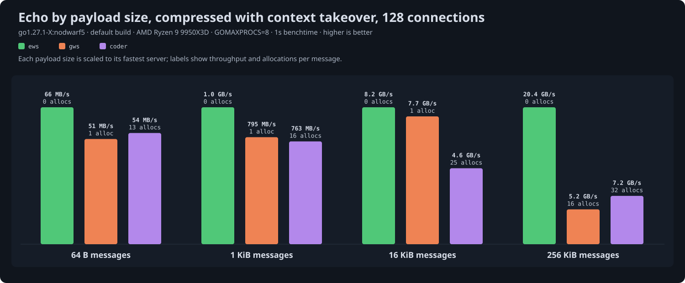
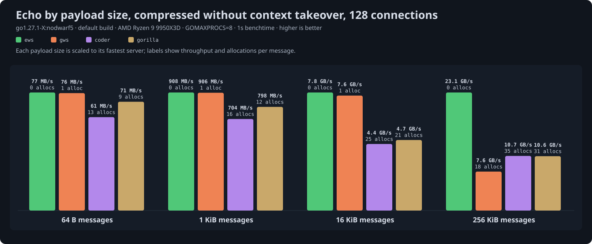
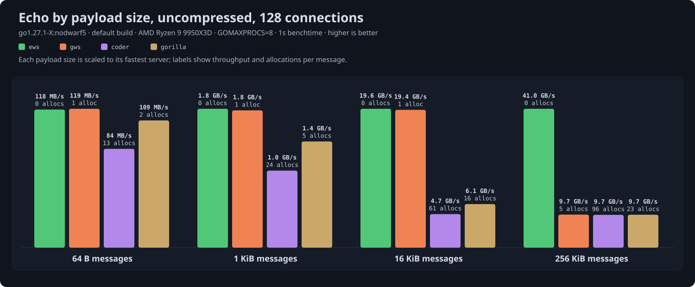
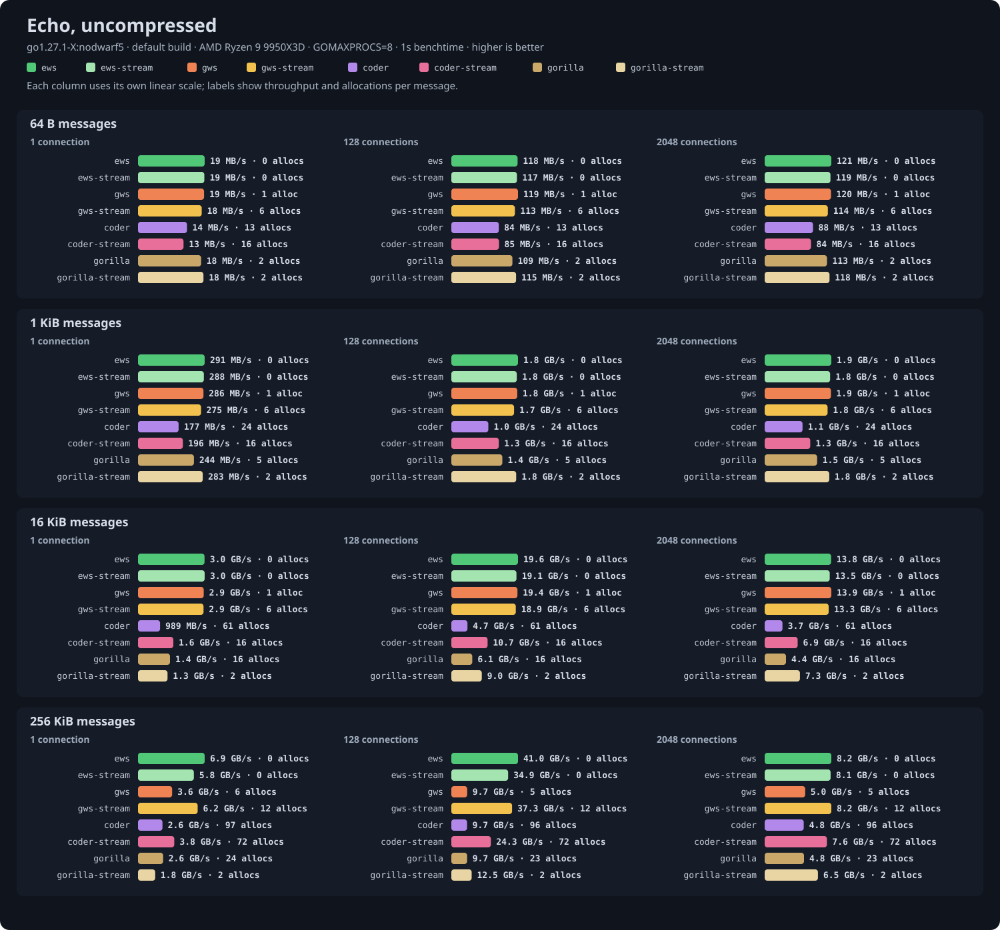
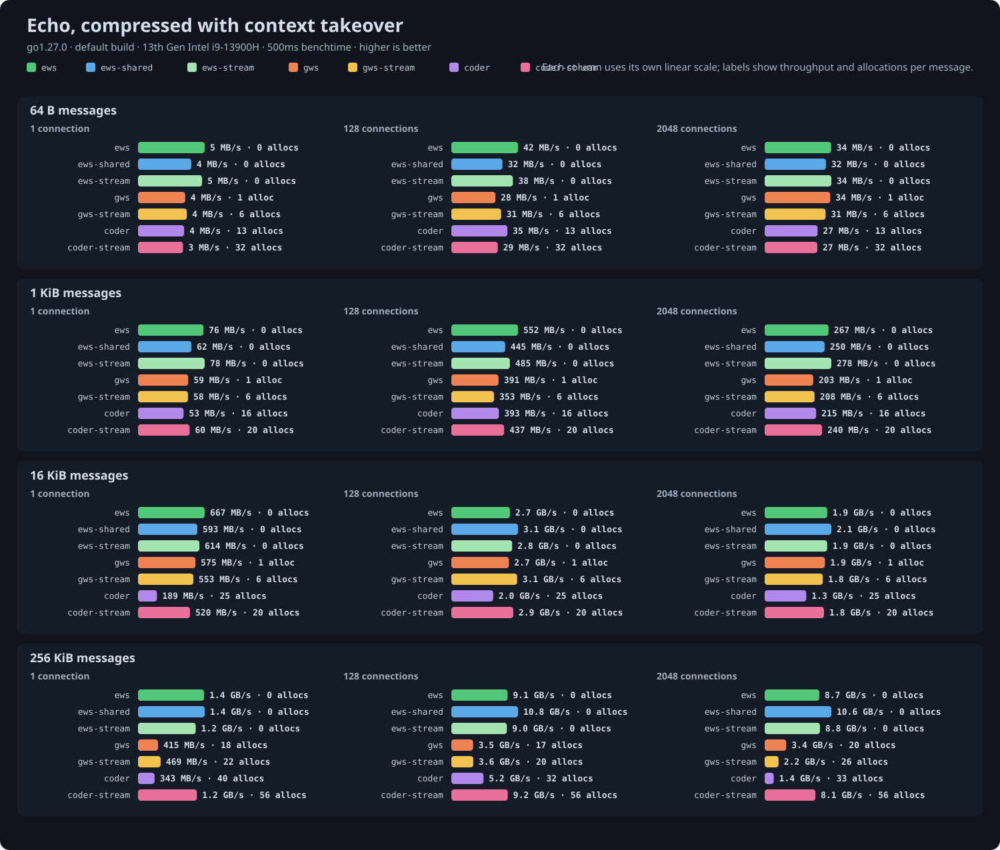
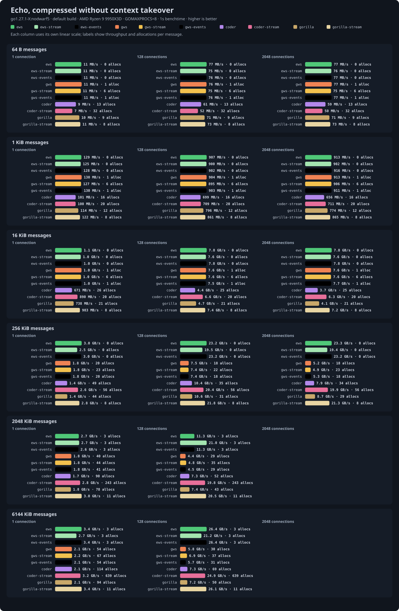

# Echo benchmark results

Run at ews commit `5387555` with `go test -run '^$' -bench Echo -benchtime 1s`; tables and charts generated from the saved output by `go run ../cmd/results` on 2026-09-26.

## Setup

- CPU: AMD Ryzen 9 9950X3D 16-Core Processor
- Kernel: 7.2.2-1-cachyos
- Go: go1.27.1-X:nodwarf5, default build: SWAR masking and the shift-based UTF-8 validator
- GOMAXPROCS: 8
- gws: v1.10.2
- coder/websocket: v1.8.15
- gorilla/websocket: v1.5.3

Echo servers behind `httptest` on loopback TCP, all driven by the same ews client, one ping-pong at a time per connection. Throughput counts payload bytes in one direction per round trip. Allocations are process-wide per message; the ews client allocates nothing, so they are effectively the server's.

- `ews`: `ws.Conn` with `ReadMessage` and `Write`, default 4 KiB read buffer. With compression it keeps a compressor attached per connection.
- `ews-shared`: the same with `CompressionShared`, borrowing a pooled compressor per message as gws and coder do. Takeover table only; it is identical to `ews` otherwise.
- `ews-stream`: `NextMessage` then `WriteFrom` reading the connection itself, so no message is held whole and compressed input is inflated as its frames arrive. Messages above `FragmentSize` (64 KiB) go out as several frames, each compressed chunk flushed on its own, and each chunk is copied out of the read buffer, which is what separates it from `ews` at 256 KiB. This is ews's streaming shape, against `gws-stream` and `coder-stream`.
- `ews-events`: the same echo as an `events.Handler` behind `events.HTTP`, one method per event, against `gws-events`.
- `gws`: gws's `ReadMessage` and `WriteMessage` in a loop, the like-for-like shape against ews. Its event-driven `ReadLoop` shares the frame path and measured the same within noise.
- `gws-stream`: gws's `NextReader` piped into `WriteFile`, so no message is held whole.
- `gws-events`: gws's `ReadLoop` driving an `OnMessage` handler that writes the message back, the shape gws documents.
- `coder`: coder/websocket with `Read` and `Write` in a loop.
- `coder-stream`: coder/websocket piping `Reader` into `Writer` through a reusable buffer, so no message is held whole.
- `gorilla`: gorilla/websocket with `ReadMessage` and `WriteMessage` in a loop. Uncompressed and no-takeover tables only, since gorilla negotiates only `no_context_takeover`.
- `gorilla-stream`: gorilla/websocket piping `NextReader` into `NextWriter` through a reusable buffer.

Compression is permessage-deflate at flate level 1, every message compressed, in two modes that are separate tables because they are different work. With context takeover each direction keeps a 32 KB history that every message extends, so the inflater is primed with a dictionary per message and both ends copy history; it compresses real traffic far better. Without takeover each message is compressed on its own. gws is configured for 15-bit windows to match the 32 KB window ews uses, since its default is 12 bits. coder/websocket uses its fixed level and pooled flate readers and writers, with its compression threshold lowered so that, like the others, it compresses every message. gorilla/websocket uses the standard library's flate. Compressed payloads are repeated JSON-like text; uncompressed payloads are random bytes.

Single-connection small-message cells are dominated by loopback round-trip latency and vary more between runs than large-message and allocation figures. Beyond the machine's thread count, more connections measure scheduling and per-connection overhead rather than parallelism.

## Uncompressed

| Size | Conns | ews | ews-stream | ews-events | gws | gws-stream | gws-events | coder | coder-stream | gorilla | gorilla-stream | allocs/op ews / ews-stream / ews-events / gws / gws-stream / gws-events / coder / coder-stream / gorilla / gorilla-stream |
|---|---|---|---|---|---|---|---|---|---|---|---|---|
| 64 B | 1 | 19 MB/s | 19 MB/s | 19 MB/s | 19 MB/s | 18 MB/s | 19 MB/s | 14 MB/s | 13 MB/s | 18 MB/s | 18 MB/s | 0 / 0 / 0 / 1 / 6 / 1 / 13 / 16 / 2 / 2 |
| 64 B | 32 | 107 MB/s | 106 MB/s | 106 MB/s | 106 MB/s | 104 MB/s | 107 MB/s | 81 MB/s | 80 MB/s | 102 MB/s | 104 MB/s | 0 / 0 / 0 / 1 / 6 / 1 / 13 / 16 / 2 / 2 |
| 64 B | 128 | 118 MB/s | 117 MB/s | 117 MB/s | 118 MB/s | 113 MB/s | 117 MB/s | 85 MB/s | 84 MB/s | 108 MB/s | 115 MB/s | 0 / 0 / 0 / 1 / 6 / 1 / 13 / 16 / 2 / 2 |
| 64 B | 512 | 120 MB/s | 118 MB/s | 120 MB/s | 120 MB/s | 114 MB/s | 118 MB/s | 89 MB/s | 87 MB/s | 113 MB/s | 118 MB/s | 0 / 0 / 0 / 1 / 6 / 1 / 13 / 16 / 2 / 2 |
| 64 B | 1024 | 121 MB/s | 118 MB/s | 120 MB/s | 120 MB/s | 116 MB/s | 119 MB/s | 90 MB/s | 86 MB/s | 114 MB/s | 118 MB/s | 0 / 0 / 0 / 1 / 6 / 1 / 13 / 16 / 2 / 2 |
| 64 B | 2048 | 120 MB/s | 119 MB/s | 119 MB/s | 120 MB/s | 115 MB/s | 119 MB/s | 88 MB/s | 85 MB/s | 113 MB/s | 118 MB/s | 0 / 0 / 0 / 1 / 6 / 1 / 13 / 16 / 2 / 2 |
| 1 KiB | 1 | 289 MB/s | 286 MB/s | 283 MB/s | 285 MB/s | 273 MB/s | 284 MB/s | 177 MB/s | 195 MB/s | 245 MB/s | 280 MB/s | 0 / 0 / 0 / 1 / 6 / 1 / 24 (2 KB) / 16 / 5 (2 KB) / 2 |
| 1 KiB | 32 | 1.7 GB/s | 1.6 GB/s | 1.7 GB/s | 1.7 GB/s | 1.6 GB/s | 1.6 GB/s | 966 MB/s | 1.3 GB/s | 1.3 GB/s | 1.6 GB/s | 0 / 0 / 0 / 1 / 6 / 1 / 24 (2 KB) / 16 / 5 (2 KB) / 2 |
| 1 KiB | 128 | 1.8 GB/s | 1.8 GB/s | 1.8 GB/s | 1.8 GB/s | 1.7 GB/s | 1.8 GB/s | 1.0 GB/s | 1.3 GB/s | 1.4 GB/s | 1.8 GB/s | 0 / 0 / 0 / 1 / 6 / 1 / 24 (2 KB) / 16 / 5 (2 KB) / 2 |
| 1 KiB | 512 | 1.8 GB/s | 1.8 GB/s | 1.9 GB/s | 1.8 GB/s | 1.8 GB/s | 1.8 GB/s | 1.1 GB/s | 1.3 GB/s | 1.5 GB/s | 1.8 GB/s | 0 / 0 / 0 / 1 / 6 / 1 / 24 (2 KB) / 16 / 5 (2 KB) / 2 |
| 1 KiB | 1024 | 1.9 GB/s | 1.8 GB/s | 1.9 GB/s | 1.9 GB/s | 1.8 GB/s | 1.8 GB/s | 1.1 GB/s | 1.3 GB/s | 1.5 GB/s | 1.8 GB/s | 0 / 0 / 0 / 1 / 6 / 1 / 24 (2 KB) / 16 / 5 (2 KB) / 2 |
| 1 KiB | 2048 | 1.9 GB/s | 1.8 GB/s | 1.8 GB/s | 1.8 GB/s | 1.8 GB/s | 1.8 GB/s | 1.1 GB/s | 1.3 GB/s | 1.5 GB/s | 1.8 GB/s | 0 / 0 / 0 / 1 / 6 / 1 / 24 (2 KB) / 16 / 5 (2 KB) / 2 |
| 16 KiB | 1 | 3.0 GB/s | 3.0 GB/s | 3.0 GB/s | 3.0 GB/s | 2.9 GB/s | 3.0 GB/s | 1.0 GB/s | 1.6 GB/s | 1.5 GB/s | 1.3 GB/s | 0 / 0 / 0 / 1 / 6 / 1 / 61 (40 KB) / 16 / 16 (38 KB) / 2 |
| 16 KiB | 32 | 18.8 GB/s | 18.8 GB/s | 18.8 GB/s | 18.6 GB/s | 18.3 GB/s | 18.4 GB/s | 4.0 GB/s | 10.3 GB/s | 5.3 GB/s | 8.6 GB/s | 0 / 0 / 0 / 1 / 6 / 1 / 61 (39 KB) / 16 / 16 (37 KB) / 2 |
| 16 KiB | 128 | 19.7 GB/s | 19.6 GB/s | 19.4 GB/s | 19.4 GB/s | 19.1 GB/s | 19.4 GB/s | 4.8 GB/s | 10.9 GB/s | 6.2 GB/s | 9.0 GB/s | 0 / 0 / 0 / 1 / 6 / 1 / 61 (38 KB) / 16 / 16 (37 KB) / 2 |
| 16 KiB | 512 | 20.1 GB/s | 20.0 GB/s | 20.0 GB/s | 19.8 GB/s | 19.6 GB/s | 19.7 GB/s | 5.2 GB/s | 10.9 GB/s | 7.0 GB/s | 9.2 GB/s | 0 / 0 / 0 / 1 / 6 / 1 / 61 (38 KB) / 16 / 16 (37 KB) / 2 |
| 16 KiB | 1024 | 19.6 GB/s | 19.5 GB/s | 19.1 GB/s | 19.3 GB/s | 18.9 GB/s | 19.3 GB/s | 4.8 GB/s | 9.9 GB/s | 6.2 GB/s | 9.0 GB/s | 0 / 0 / 0 / 1 / 6 / 1 / 61 (38 KB) / 16 / 16 (37 KB) / 2 |
| 16 KiB | 2048 | 13.9 GB/s | 13.6 GB/s | 13.6 GB/s | 14.0 GB/s | 13.5 GB/s | 13.8 GB/s | 3.7 GB/s | 6.9 GB/s | 4.5 GB/s | 7.3 GB/s | 0 / 0 / 0 / 1 / 6 / 1 / 61 (38 KB) / 16 / 16 (37 KB) / 2 |
| 256 KiB | 1 | 6.7 GB/s | 6.0 GB/s | 6.7 GB/s | 3.6 GB/s | 6.3 GB/s | 3.6 GB/s | 2.8 GB/s | 3.7 GB/s | 2.8 GB/s | 1.8 GB/s | 0 / 0 / 0 / 5 (602 KB) / 12 / 5 (601 KB) / 97 (722 KB) / 72 (3 KB) / 24 (719 KB) / 2 |
| 256 KiB | 32 | 41.2 GB/s | 35.0 GB/s | 42.2 GB/s | 13.5 GB/s | 36.7 GB/s | 13.7 GB/s | 12.0 GB/s | 25.5 GB/s | 12.5 GB/s | 12.9 GB/s | 0 / 0 / 0 / 5 (536 KB) / 12 / 5 (536 KB) / 96 (629 KB) / 72 (2 KB) / 23 (624 KB) / 2 |
| 256 KiB | 128 | 41.5 GB/s | 34.4 GB/s | 41.6 GB/s | 10.1 GB/s | 36.7 GB/s | 10.2 GB/s | 9.9 GB/s | 24.8 GB/s | 9.7 GB/s | 12.5 GB/s | 0 / 0 / 0 / 5 (533 KB) / 12 / 5 (534 KB) / 96 (623 KB) / 72 (3 KB) / 23 (621 KB) / 2 |
| 256 KiB | 512 | 11.9 GB/s | 11.0 GB/s | 11.9 GB/s | 5.9 GB/s | 11.7 GB/s | 5.9 GB/s | 5.6 GB/s | 10.4 GB/s | 5.5 GB/s | 8.3 GB/s | 0 / 0 / 0 / 5 (535 KB) / 12 / 5 (538 KB) / 96 (625 KB) / 72 (2 KB) / 23 (623 KB) / 2 |
| 256 KiB | 1024 | 8.4 GB/s | 8.4 GB/s | 8.5 GB/s | 5.1 GB/s | 8.5 GB/s | 5.1 GB/s | 4.9 GB/s | 7.9 GB/s | 4.9 GB/s | 6.8 GB/s | 0 / 0 / 0 / 5 (540 KB) / 12 / 5 (541 KB) / 96 (630 KB) / 72 (2 KB) / 23 (627 KB) / 2 |
| 256 KiB | 2048 | 8.2 GB/s | 8.2 GB/s | 8.2 GB/s | 5.0 GB/s | 8.3 GB/s | 5.0 GB/s | 4.8 GB/s | 7.7 GB/s | 4.8 GB/s | 6.5 GB/s | 0 / 0 / 0 / 5 (551 KB) / 12 / 5 (552 KB) / 96 (642 KB) / 72 (2 KB) / 23 (641 KB) / 2 |
| 2 MiB | 1 | 9.3 GB/s | 5.9 GB/s | 9.3 GB/s | 4.5 GB/s | 7.5 GB/s | 4.4 GB/s | 4.2 GB/s | 4.5 GB/s | 4.0 GB/s | 1.8 GB/s | 3 (1 KB) / 3 (3 KB) / 3 (1 KB) / 10 (4884 KB) / 57 (6 KB) / 10 (4909 KB) / 128 (5686 KB) / 523 (56 KB) / 35 (5651 KB) / 5 (23 KB) |
| 2 MiB | 32 | 14.7 GB/s | 12.2 GB/s | 14.9 GB/s | 5.1 GB/s | 12.2 GB/s | 5.1 GB/s | 5.2 GB/s | 11.5 GB/s | 5.1 GB/s | 8.5 GB/s | 3 (1 KB) / 3 (1 KB) / 3 (1 KB) / 9 (4282 KB) / 57 (3 KB) / 9 (4321 KB) / 126 (4884 KB) / 523 (22 KB) / 33 (4868 KB) / 5 (2 KB) |
| 2 MiB | 128 | 9.3 GB/s | 7.3 GB/s | 9.2 GB/s | 4.5 GB/s | 7.7 GB/s | 4.3 GB/s | 4.5 GB/s | 7.3 GB/s | 4.5 GB/s | 6.7 GB/s | 3 (1 KB) / 3 (1 KB) / 3 (1 KB) / 8 (4231 KB) / 57 (2 KB) / 8 (4230 KB) / 125 (4748 KB) / 523 (20 KB) / 32 (4726 KB) / 5 |
| 6 MiB | 1 | 9.9 GB/s | 6.2 GB/s | 9.9 GB/s | 4.8 GB/s | 7.3 GB/s | 4.8 GB/s | 4.1 GB/s | 4.3 GB/s | 4.0 GB/s | 1.8 GB/s | 3 (8 KB) / 3 (27 KB) / 3 (22 KB) / 11 (15752 KB) / 153 (51 KB) / 11 (15939 KB) / 144 (19103 KB) / 1547 (136 KB) / 39 (19015 KB) / 5 (24 KB) |
| 6 MiB | 32 | 6.0 GB/s | 8.2 GB/s | 6.0 GB/s | 3.7 GB/s | 8.2 GB/s | 3.7 GB/s | 4.0 GB/s | 8.3 GB/s | 4.0 GB/s | 7.0 GB/s | 3 (100 KB) / 3 (14 KB) / 3 (57 KB) / 9 (12932 KB) / 153 (18 KB) / 9 (12911 KB) / 141 (15419 KB) / 1547 (65 KB) / 36 (15434 KB) / 5 (7 KB) |
| 6 MiB | 128 | 4.9 GB/s | 6.4 GB/s | 4.9 GB/s | 3.4 GB/s | 6.3 GB/s | 3.4 GB/s | 3.6 GB/s | 6.3 GB/s | 3.6 GB/s | 5.9 GB/s | 3 (211 KB) / 3 (9 KB) / 3 (198 KB) / 9 (13244 KB) / 153 (11 KB) / 9 (13256 KB) / 141 (15622 KB) / 1547 (57 KB) / 35 (15374 KB) / 5 |

## Compressed with context takeover

| Size | Conns | ews | ews-shared | ews-stream | ews-events | gws | gws-stream | gws-events | coder | coder-stream | allocs/op ews / ews-shared / ews-stream / ews-events / gws / gws-stream / gws-events / coder / coder-stream |
|---|---|---|---|---|---|---|---|---|---|---|---|
| 64 B | 1 | 10 MB/s | 8 MB/s | 10 MB/s | 10 MB/s | 8 MB/s | 7 MB/s | 8 MB/s | 8 MB/s | 7 MB/s | 0 / 0 / 0 / 0 / 1 / 6 / 1 / 13 (1 KB) / 32 (1 KB) |
| 64 B | 32 | 66 MB/s | 54 MB/s | 65 MB/s | 66 MB/s | 49 MB/s | 50 MB/s | 49 MB/s | 54 MB/s | 47 MB/s | 0 / 0 / 0 / 0 / 1 / 6 / 1 / 13 / 32 (1 KB) |
| 64 B | 128 | 66 MB/s | 54 MB/s | 66 MB/s | 66 MB/s | 51 MB/s | 51 MB/s | 51 MB/s | 54 MB/s | 47 MB/s | 0 / 0 / 0 / 0 / 1 / 6 / 1 / 13 / 32 (1 KB) |
| 64 B | 512 | 66 MB/s | 55 MB/s | 66 MB/s | 67 MB/s | 52 MB/s | 52 MB/s | 52 MB/s | 55 MB/s | 47 MB/s | 0 / 0 / 0 / 0 / 1 / 6 / 1 / 13 / 32 (1 KB) |
| 64 B | 1024 | 62 MB/s | 49 MB/s | 61 MB/s | 62 MB/s | 45 MB/s | 45 MB/s | 45 MB/s | 49 MB/s | 42 MB/s | 0 / 0 / 0 / 0 / 1 / 6 / 1 / 13 / 32 (1 KB) |
| 64 B | 2048 | 56 MB/s | 47 MB/s | 55 MB/s | 55 MB/s | 46 MB/s | 46 MB/s | 46 MB/s | 45 MB/s | 40 MB/s | 0 / 0 / 0 / 0 / 1 / 6 / 1 / 13 / 32 (1 KB) |
| 1 KiB | 1 | 157 MB/s | 124 MB/s | 156 MB/s | 157 MB/s | 121 MB/s | 118 MB/s | 121 MB/s | 115 MB/s | 119 MB/s | 0 / 0 / 0 / 0 / 1 / 6 / 1 / 16 (2 KB) / 20 |
| 1 KiB | 32 | 1.0 GB/s | 836 MB/s | 998 MB/s | 1.0 GB/s | 759 MB/s | 782 MB/s | 763 MB/s | 784 MB/s | 802 MB/s | 0 / 0 / 0 / 0 / 1 / 6 / 1 / 16 (2 KB) / 20 |
| 1 KiB | 128 | 1.0 GB/s | 839 MB/s | 1.0 GB/s | 1.0 GB/s | 795 MB/s | 795 MB/s | 793 MB/s | 763 MB/s | 806 MB/s | 0 / 0 / 0 / 0 / 1 / 6 / 1 / 16 (2 KB) / 20 |
| 1 KiB | 512 | 964 MB/s | 789 MB/s | 947 MB/s | 960 MB/s | 749 MB/s | 752 MB/s | 751 MB/s | 717 MB/s | 752 MB/s | 0 / 0 / 0 / 0 / 1 / 6 / 1 / 16 (2 KB) / 20 |
| 1 KiB | 1024 | 717 MB/s | 597 MB/s | 713 MB/s | 720 MB/s | 549 MB/s | 548 MB/s | 547 MB/s | 547 MB/s | 564 MB/s | 0 / 0 / 0 / 0 / 1 / 6 / 1 / 16 (2 KB) / 20 |
| 1 KiB | 2048 | 521 MB/s | 473 MB/s | 517 MB/s | 530 MB/s | 395 MB/s | 391 MB/s | 395 MB/s | 401 MB/s | 420 MB/s | 0 / 0 / 0 / 0 / 1 / 6 / 1 / 16 (2 KB) / 20 |
| 16 KiB | 1 | 1.3 GB/s | 1.2 GB/s | 1.3 GB/s | 1.3 GB/s | 1.2 GB/s | 1.1 GB/s | 1.2 GB/s | 779 MB/s | 1.1 GB/s | 0 / 0 / 0 / 0 / 1 / 6 / 1 / 25 (41 KB) / 20 |
| 16 KiB | 32 | 8.9 GB/s | 7.9 GB/s | 8.7 GB/s | 8.8 GB/s | 7.8 GB/s | 7.8 GB/s | 7.7 GB/s | 5.6 GB/s | 7.6 GB/s | 0 / 0 / 0 / 0 / 1 / 6 / 1 / 25 (37 KB) / 20 |
| 16 KiB | 128 | 8.2 GB/s | 7.9 GB/s | 8.0 GB/s | 8.3 GB/s | 7.7 GB/s | 7.7 GB/s | 7.7 GB/s | 4.6 GB/s | 7.1 GB/s | 0 / 0 / 0 / 0 / 1 / 6 / 1 / 25 (37 KB) / 20 |
| 16 KiB | 512 | 3.7 GB/s | 4.5 GB/s | 3.6 GB/s | 3.7 GB/s | 5.2 GB/s | 5.2 GB/s | 5.2 GB/s | 3.0 GB/s | 4.0 GB/s | 0 / 0 / 0 / 0 / 1 / 6 / 1 / 25 (37 KB) / 20 |
| 16 KiB | 1024 | 2.8 GB/s | 3.3 GB/s | 2.7 GB/s | 2.7 GB/s | 3.6 GB/s | 3.7 GB/s | 3.6 GB/s | 2.3 GB/s | 2.9 GB/s | 0 / 0 / 0 / 0 / 1 / 6 / 1 / 25 (38 KB) / 20 |
| 16 KiB | 2048 | 2.4 GB/s | 2.8 GB/s | 2.4 GB/s | 2.4 GB/s | 2.9 GB/s | 2.9 GB/s | 2.9 GB/s | 1.9 GB/s | 2.4 GB/s | 0 / 0 / 0 / 0 / 1 / 6 / 1 / 25 (38 KB) / 20 |
| 256 KiB | 1 | 2.8 GB/s | 2.8 GB/s | 2.4 GB/s | 2.9 GB/s | 1.9 GB/s | 1.9 GB/s | 1.9 GB/s | 1.5 GB/s | 2.5 GB/s | 0 / 0 / 0 / 0 / 18 (1377 KB) / 22 (1137 KB) / 18 (1376 KB) / 40 (836 KB) / 56 (2 KB) |
| 256 KiB | 32 | 21.7 GB/s | 21.9 GB/s | 18.4 GB/s | 21.8 GB/s | 7.0 GB/s | 8.7 GB/s | 6.9 GB/s | 11.6 GB/s | 19.2 GB/s | 0 / 0 / 0 / 0 / 17 (1314 KB) / 21 (1077 KB) / 17 (1313 KB) / 32 (633 KB) / 56 (2 KB) |
| 256 KiB | 128 | 20.4 GB/s | 21.9 GB/s | 18.2 GB/s | 20.3 GB/s | 5.2 GB/s | 5.6 GB/s | 5.3 GB/s | 7.2 GB/s | 17.9 GB/s | 0 / 0 / 0 / 0 / 16 (1305 KB) / 20 (1067 KB) / 16 (1306 KB) / 32 (622 KB) / 56 (2 KB) |
| 256 KiB | 512 | 10.0 GB/s | 17.0 GB/s | 12.5 GB/s | 10.0 GB/s | 4.5 GB/s | 4.4 GB/s | 4.5 GB/s | 5.2 GB/s | 9.6 GB/s | 0 / 0 / 0 / 0 / 16 (1306 KB) / 20 (1075 KB) / 16 (1307 KB) / 32 (627 KB) / 56 (2 KB) |
| 256 KiB | 1024 | 8.8 GB/s | 14.3 GB/s | 10.8 GB/s | 8.8 GB/s | 4.3 GB/s | 4.3 GB/s | 4.3 GB/s | 5.0 GB/s | 8.5 GB/s | 0 / 0 / 0 / 0 / 17 (1318 KB) / 20 (1091 KB) / 16 (1319 KB) / 32 (640 KB) / 56 (2 KB) |
| 256 KiB | 2048 | 8.4 GB/s | 12.9 GB/s | 10.1 GB/s | 8.4 GB/s | 4.2 GB/s | 4.1 GB/s | 4.2 GB/s | 4.9 GB/s | 8.2 GB/s | 0 / 0 / 0 / 0 / 17 (1347 KB) / 21 (1137 KB) / 17 (1348 KB) / 33 (667 KB) / 56 (2 KB) |
| 2 MiB | 1 | 2.6 GB/s | 2.5 GB/s | 2.6 GB/s | 2.7 GB/s | 1.8 GB/s | 1.8 GB/s | 1.8 GB/s | 1.9 GB/s | 2.7 GB/s | 3 (9 KB) / 3 (5 KB) / 3 (8 KB) / 3 / 34 (12600 KB) / 39 (10178 KB) / 35 (12648 KB) / 68 (7530 KB) / 243 (27 KB) |
| 2 MiB | 32 | 10.6 GB/s | 9.3 GB/s | 20.6 GB/s | 10.5 GB/s | 3.9 GB/s | 4.4 GB/s | 4.0 GB/s | 6.8 GB/s | 19.2 GB/s | 3 (2 KB) / 3 (6 KB) / 3 (2 KB) / 3 (5 KB) / 28 (11579 KB) / 35 (9738 KB) / 28 (11624 KB) / 50 (5360 KB) / 243 (13 KB) |
| 2 MiB | 128 | 10.2 GB/s | 9.2 GB/s | 20.6 GB/s | 10.2 GB/s | 4.1 GB/s | 4.5 GB/s | 4.1 GB/s | 6.9 GB/s | 17.9 GB/s | 3 (2 KB) / 3 (12 KB) / 3 (2 KB) / 3 (2 KB) / 26 (11005 KB) / 31 (8964 KB) / 26 (11084 KB) / 47 (4944 KB) / 243 (11 KB) |
| 6 MiB | 1 | 3.3 GB/s | 3.1 GB/s | 2.7 GB/s | 3.4 GB/s | 2.0 GB/s | 2.1 GB/s | 2.0 GB/s | 2.2 GB/s | 3.2 GB/s | 3 (26 KB) / 3 (67 KB) / 3 (33 KB) / 3 / 40 (30374 KB) / 52 (24177 KB) / 40 (30607 KB) / 87 (20027 KB) / 639 (52 KB) |
| 6 MiB | 32 | 26.0 GB/s | 20.8 GB/s | 20.8 GB/s | 26.5 GB/s | 5.0 GB/s | 5.6 GB/s | 5.0 GB/s | 6.8 GB/s | 23.9 GB/s | 3 (8 KB) / 3 (17 KB) / 3 (7 KB) / 3 (8 KB) / 30 (25403 KB) / 40 (20058 KB) / 29 (25305 KB) / 70 (16846 KB) / 639 (34 KB) |
| 6 MiB | 128 | 26.3 GB/s | 21.1 GB/s | 20.7 GB/s | 26.2 GB/s | 5.1 GB/s | 5.9 GB/s | 5.2 GB/s | 7.1 GB/s | 23.9 GB/s | 3 / 3 (6 KB) / 3 / 3 (1 KB) / 28 (24688 KB) / 33 (18511 KB) / 28 (24734 KB) / 64 (15887 KB) / 639 (23 KB) |

## Compressed without context takeover

| Size | Conns | ews | ews-stream | ews-events | gws | gws-stream | gws-events | coder | coder-stream | gorilla | gorilla-stream | allocs/op ews / ews-stream / ews-events / gws / gws-stream / gws-events / coder / coder-stream / gorilla / gorilla-stream |
|---|---|---|---|---|---|---|---|---|---|---|---|---|
| 64 B | 1 | 11 MB/s | 11 MB/s | 11 MB/s | 11 MB/s | 11 MB/s | 11 MB/s | 9 MB/s | 7 MB/s | 10 MB/s | 11 MB/s | 0 / 0 / 0 / 1 / 6 / 1 / 13 (1 KB) / 32 (2 KB) / 9 (1 KB) / 8 |
| 64 B | 32 | 76 MB/s | 74 MB/s | 75 MB/s | 77 MB/s | 74 MB/s | 76 MB/s | 61 MB/s | 52 MB/s | 71 MB/s | 72 MB/s | 0 / 0 / 0 / 1 / 6 / 1 / 13 (1 KB) / 32 (1 KB) / 9 / 8 |
| 64 B | 128 | 77 MB/s | 75 MB/s | 76 MB/s | 76 MB/s | 75 MB/s | 76 MB/s | 61 MB/s | 52 MB/s | 71 MB/s | 73 MB/s | 0 / 0 / 0 / 1 / 6 / 1 / 13 (1 KB) / 32 (1 KB) / 9 / 8 |
| 64 B | 512 | 76 MB/s | 76 MB/s | 76 MB/s | 77 MB/s | 75 MB/s | 76 MB/s | 60 MB/s | 52 MB/s | 71 MB/s | 74 MB/s | 0 / 0 / 0 / 1 / 6 / 1 / 13 (1 KB) / 32 (1 KB) / 9 / 8 |
| 64 B | 1024 | 77 MB/s | 76 MB/s | 77 MB/s | 77 MB/s | 75 MB/s | 77 MB/s | 60 MB/s | 51 MB/s | 71 MB/s | 73 MB/s | 0 / 0 / 0 / 1 / 6 / 1 / 13 (1 KB) / 32 (1 KB) / 9 / 8 |
| 64 B | 2048 | 77 MB/s | 76 MB/s | 77 MB/s | 77 MB/s | 75 MB/s | 77 MB/s | 59 MB/s | 50 MB/s | 71 MB/s | 73 MB/s | 0 / 0 / 0 / 1 / 6 / 1 / 13 (1 KB) / 32 (1 KB) / 9 / 8 |
| 1 KiB | 1 | 129 MB/s | 125 MB/s | 128 MB/s | 130 MB/s | 127 MB/s | 130 MB/s | 101 MB/s | 100 MB/s | 114 MB/s | 122 MB/s | 0 / 0 / 0 / 1 / 6 / 1 / 16 (4 KB) / 20 (1 KB) / 12 (4 KB) / 8 |
| 1 KiB | 32 | 902 MB/s | 891 MB/s | 911 MB/s | 910 MB/s | 903 MB/s | 908 MB/s | 702 MB/s | 718 MB/s | 795 MB/s | 852 MB/s | 0 / 0 / 0 / 1 / 6 / 1 / 16 (3 KB) / 20 / 12 (2 KB) / 8 |
| 1 KiB | 128 | 907 MB/s | 900 MB/s | 902 MB/s | 904 MB/s | 895 MB/s | 903 MB/s | 699 MB/s | 709 MB/s | 796 MB/s | 861 MB/s | 0 / 0 / 0 / 1 / 6 / 1 / 16 (3 KB) / 20 / 12 (2 KB) / 8 |
| 1 KiB | 512 | 910 MB/s | 894 MB/s | 905 MB/s | 909 MB/s | 900 MB/s | 908 MB/s | 697 MB/s | 717 MB/s | 795 MB/s | 868 MB/s | 0 / 0 / 0 / 1 / 6 / 1 / 16 (3 KB) / 20 / 12 (2 KB) / 8 |
| 1 KiB | 1024 | 913 MB/s | 898 MB/s | 911 MB/s | 913 MB/s | 905 MB/s | 909 MB/s | 687 MB/s | 712 MB/s | 793 MB/s | 867 MB/s | 0 / 0 / 0 / 1 / 6 / 1 / 16 (3 KB) / 20 (1 KB) / 12 (2 KB) / 8 |
| 1 KiB | 2048 | 913 MB/s | 902 MB/s | 916 MB/s | 913 MB/s | 906 MB/s | 911 MB/s | 656 MB/s | 711 MB/s | 774 MB/s | 865 MB/s | 0 / 0 / 0 / 1 / 6 / 1 / 16 (3 KB) / 20 (1 KB) / 12 (3 KB) / 8 |
| 16 KiB | 1 | 1.1 GB/s | 1.0 GB/s | 1.0 GB/s | 1.0 GB/s | 1.0 GB/s | 1.0 GB/s | 671 MB/s | 890 MB/s | 738 MB/s | 983 MB/s | 0 / 0 / 0 / 1 / 6 / 1 / 26 (72 KB) / 20 (1 KB) / 21 (66 KB) / 8 |
| 16 KiB | 32 | 7.8 GB/s | 7.6 GB/s | 7.7 GB/s | 7.6 GB/s | 7.7 GB/s | 7.6 GB/s | 4.4 GB/s | 6.6 GB/s | 4.6 GB/s | 7.3 GB/s | 0 / 0 / 0 / 1 / 6 / 1 / 25 (44 KB) / 20 / 21 (44 KB) / 8 |
| 16 KiB | 128 | 7.8 GB/s | 7.6 GB/s | 7.8 GB/s | 7.6 GB/s | 7.6 GB/s | 7.5 GB/s | 4.4 GB/s | 6.6 GB/s | 4.7 GB/s | 7.4 GB/s | 0 / 0 / 0 / 1 / 6 / 1 / 25 (43 KB) / 20 / 21 (43 KB) / 8 |
| 16 KiB | 512 | 7.8 GB/s | 7.6 GB/s | 7.8 GB/s | 7.6 GB/s | 7.6 GB/s | 7.6 GB/s | 4.3 GB/s | 6.6 GB/s | 4.7 GB/s | 7.4 GB/s | 0 / 0 / 0 / 1 / 6 / 1 / 25 (43 KB) / 20 / 21 (42 KB) / 8 |
| 16 KiB | 1024 | 7.9 GB/s | 7.6 GB/s | 7.8 GB/s | 7.7 GB/s | 7.6 GB/s | 7.6 GB/s | 4.0 GB/s | 6.6 GB/s | 4.6 GB/s | 7.4 GB/s | 0 / 0 / 0 / 1 / 6 / 1 / 25 (44 KB) / 20 (1 KB) / 21 (42 KB) / 8 |
| 16 KiB | 2048 | 7.8 GB/s | 7.6 GB/s | 7.8 GB/s | 7.6 GB/s | 7.6 GB/s | 7.7 GB/s | 3.7 GB/s | 6.3 GB/s | 4.1 GB/s | 7.2 GB/s | 0 / 0 / 0 / 1 / 6 / 1 / 25 (43 KB) / 20 (1 KB) / 21 (40 KB) / 8 |
| 256 KiB | 1 | 3.0 GB/s | 2.5 GB/s | 3.0 GB/s | 1.8 GB/s | 1.8 GB/s | 1.8 GB/s | 1.4 GB/s | 2.6 GB/s | 1.4 GB/s | 2.8 GB/s | 0 / 0 / 0 / 20 (1459 KB) / 23 (1203 KB) / 20 (1449 KB) / 49 (1254 KB) / 56 (4 KB) / 44 (1241 KB) / 8 |
| 256 KiB | 32 | 23.3 GB/s | 19.4 GB/s | 23.2 GB/s | 7.4 GB/s | 8.6 GB/s | 7.4 GB/s | 9.3 GB/s | 20.4 GB/s | 9.7 GB/s | 21.8 GB/s | 0 / 0 / 0 / 18 (1358 KB) / 22 (1124 KB) / 18 (1360 KB) / 36 (770 KB) / 56 (3 KB) / 32 (772 KB) / 8 |
| 256 KiB | 128 | 23.2 GB/s | 19.5 GB/s | 23.2 GB/s | 7.5 GB/s | 7.4 GB/s | 7.4 GB/s | 10.4 GB/s | 20.4 GB/s | 10.6 GB/s | 21.8 GB/s | 0 / 0 / 0 / 18 (1360 KB) / 22 (1135 KB) / 18 (1363 KB) / 35 (717 KB) / 56 (3 KB) / 31 (719 KB) / 8 |
| 256 KiB | 512 | 23.3 GB/s | 19.6 GB/s | 23.3 GB/s | 6.4 GB/s | 5.4 GB/s | 6.4 GB/s | 10.2 GB/s | 20.5 GB/s | 10.5 GB/s | 21.8 GB/s | 0 / 0 / 0 / 18 (1345 KB) / 21 (1113 KB) / 18 (1362 KB) / 34 (678 KB) / 56 (2 KB) / 30 (685 KB) / 8 |
| 256 KiB | 1024 | 23.6 GB/s | 19.5 GB/s | 23.2 GB/s | 5.7 GB/s | 5.2 GB/s | 5.7 GB/s | 9.1 GB/s | 20.4 GB/s | 9.5 GB/s | 21.7 GB/s | 0 / 0 / 0 / 17 (1339 KB) / 21 (1144 KB) / 18 (1341 KB) / 34 (677 KB) / 56 (2 KB) / 29 (678 KB) / 8 |
| 256 KiB | 2048 | 23.3 GB/s | 19.4 GB/s | 23.2 GB/s | 5.2 GB/s | 4.9 GB/s | 5.3 GB/s | 7.9 GB/s | 19.9 GB/s | 8.7 GB/s | 21.3 GB/s | 0 / 0 / 0 / 18 (1354 KB) / 23 (1218 KB) / 18 (1357 KB) / 34 (701 KB) / 56 (2 KB) / 29 (681 KB) / 8 |
| 2 MiB | 1 | 2.7 GB/s | 2.7 GB/s | 2.6 GB/s | 1.8 GB/s | 1.8 GB/s | 1.8 GB/s | 1.7 GB/s | 2.8 GB/s | 1.8 GB/s | 3.0 GB/s | 3 (9 KB) / 3 (3 KB) / 3 (7 KB) / 40 (12532 KB) / 44 (10118 KB) / 41 (12714 KB) / 90 (8870 KB) / 243 (37 KB) / 78 (8851 KB) / 11 (13 KB) |
| 2 MiB | 32 | 11.0 GB/s | 20.8 GB/s | 11.0 GB/s | 4.3 GB/s | 4.8 GB/s | 4.3 GB/s | 7.4 GB/s | 19.6 GB/s | 7.4 GB/s | 20.3 GB/s | 3 (3 KB) / 3 (2 KB) / 3 (3 KB) / 32 (11729 KB) / 40 (9845 KB) / 33 (11752 KB) / 60 (6131 KB) / 243 (14 KB) / 52 (6299 KB) / 11 (6 KB) |
| 2 MiB | 128 | 11.3 GB/s | 21.0 GB/s | 11.3 GB/s | 4.4 GB/s | 4.8 GB/s | 4.5 GB/s | 7.3 GB/s | 19.8 GB/s | 7.4 GB/s | 20.5 GB/s | 3 (2 KB) / 3 (2 KB) / 3 (2 KB) / 29 (11256 KB) / 35 (9185 KB) / 29 (11223 KB) / 52 (5363 KB) / 243 (16 KB) / 43 (5283 KB) / 11 (4 KB) |
| 6 MiB | 1 | 3.4 GB/s | 2.7 GB/s | 3.4 GB/s | 2.1 GB/s | 2.2 GB/s | 2.1 GB/s | 2.1 GB/s | 3.2 GB/s | 2.1 GB/s | 3.4 GB/s | 3 (29 KB) / 3 (37 KB) / 3 (14 KB) / 54 (28584 KB) / 67 (22789 KB) / 54 (28857 KB) / 114 (21446 KB) / 639 (57 KB) / 94 (22334 KB) / 11 (31 KB) |
| 6 MiB | 32 | 26.4 GB/s | 20.7 GB/s | 26.1 GB/s | 5.6 GB/s | 6.5 GB/s | 5.6 GB/s | 6.9 GB/s | 24.8 GB/s | 6.8 GB/s | 25.8 GB/s | 3 (3 KB) / 3 (13 KB) / 3 (12 KB) / 34 (24798 KB) / 47 (19491 KB) / 34 (24820 KB) / 83 (17664 KB) / 639 (37 KB) / 62 (17863 KB) / 11 (8 KB) |
| 6 MiB | 128 | 26.4 GB/s | 21.2 GB/s | 26.4 GB/s | 5.8 GB/s | 6.9 GB/s | 5.7 GB/s | 7.3 GB/s | 24.9 GB/s | 7.2 GB/s | 26.1 GB/s | 3 (2 KB) / 3 (3 KB) / 3 (6 KB) / 30 (24330 KB) / 37 (18330 KB) / 31 (24352 KB) / 69 (16292 KB) / 639 (30 KB) / 50 (16428 KB) / 11 (3 KB) |

## Reading the numbers

- Small messages are bound by loopback round trips, so all servers tie uncompressed. Compressed with takeover, ews leads because its deflate path allocates nothing and reuses pooled or per-connection helpers.
- Without takeover ews, gws and the streaming paths tie from 64 bytes through 16 KiB; coder and gorilla's simple APIs trail on allocations. At 256 KiB ews leads the fastest streaming paths and is several times faster than the simple APIs. Comparing the compressed tables shows the cost of takeover: a 32 KB dictionary is primed per message and history is copied on both ends. Takeover buys compression ratio rather than raw speed on traffic that already repeats within each message, and its per-connection history becomes costly at high concurrency.
- 16 KiB frames exceed the 4 KiB read buffer. ews reads the remainder straight into the message buffer, so both libraries do two reads and one copy, and they tie.
- Large messages favor ews and the streaming variants. gws's and coder's simple read APIs allocate a buffer above their pool thresholds on every such message.
- With hundreds of connections and 256 KiB messages every library is bound by memory bandwidth, with a quarter-megabyte buffer per connection in flight on each side.
- coder's documented `Read` assembles messages through `io.ReadAll`, which dominates its large-message cells; piping `Reader` into `Writer` is several times faster there and is the fairer comparison for large messages, though slightly slower on small ones.

