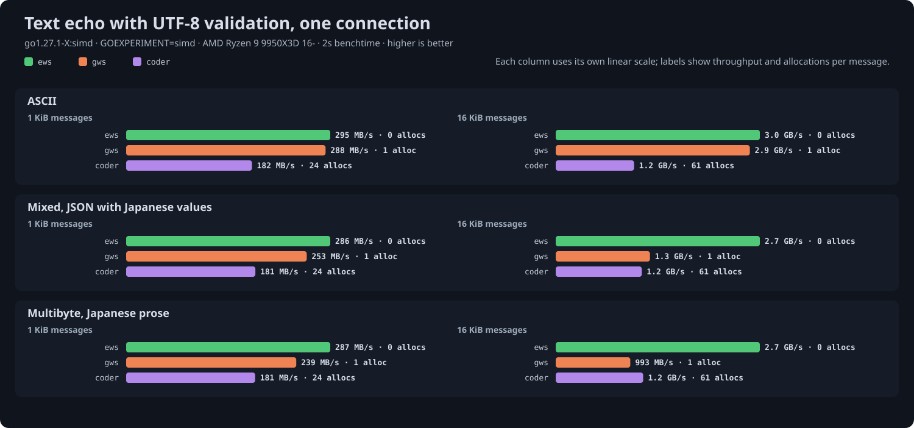
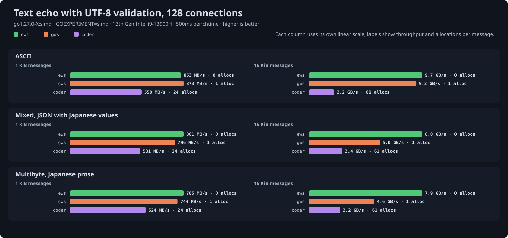

# Text validation benchmark results

Generated 2026-09-17 from `go test -run '^$' -bench UTF8 -benchtime 2s | go run ../cmd/results` at ews commit `3cd8627`.

## Setup

- CPU: AMD Ryzen 9 9950X3D 16-Core Processor
- Kernel: 7.2.2-1-cachyos
- Go: go1.27.1-X:simd, `GOEXPERIMENT=simd`: SIMD masking and, on amd64, SIMD UTF-8 validation
- GOMAXPROCS: 8
- gws: v1.10.2
- coder/websocket: v1.8.15
- gorilla/websocket: v1.5.3

Text echo across payload kinds, timed like the echo benchmark: one ping-pong at a time per connection, throughput in payload bytes one way. Servers validate UTF-8 where the library offers it, so the difference between columns is the validation pass.

- `ews`: `ReadMessage` and `Write` with `ValidateUTF8` on: one pass over each received text message, a shift-based DFA by default or SIMD lookups under `GOEXPERIMENT=simd`, after skipping the ASCII prefix with word loads.
- `gws`: `ReadMessage` and `WriteMessage` with `CheckUtf8Enabled`, which runs the standard library's `utf8.Valid` on received text and on outgoing text as well, so an echo validates twice.
- `coder`: `Read` and `Write`; coder/websocket has no UTF-8 validation to enable, so this column is the no-validation baseline.

Payloads are JSON-like ASCII, JSON with Japanese values (mixed), and Japanese prose (multibyte), cut on rune boundaries. Clients are ews connections without validation, so the client side costs the same for every server.

## Results

| Kind | Size | Conns | ews | gws | coder | allocs/op ews / gws / coder |
|---|---|---|---|---|---|---|
| ascii | 1 KiB | 1 | 291 MB/s | 283 MB/s | 186 MB/s | 0 / 1 / 24 (2 KB) |
| ascii | 1 KiB | 128 | 1.8 GB/s | 1.8 GB/s | 994 MB/s | 0 / 1 / 24 (2 KB) |
| ascii | 16 KiB | 1 | 2.9 GB/s | 2.8 GB/s | 1.1 GB/s | 0 / 1 / 61 (40 KB) |
| ascii | 16 KiB | 128 | 19.1 GB/s | 18.2 GB/s | 4.7 GB/s | 0 / 1 / 61 (39 KB) |
| mixed | 1 KiB | 1 | 284 MB/s | 249 MB/s | 185 MB/s | 0 / 1 / 24 (2 KB) |
| mixed | 1 KiB | 128 | 1.8 GB/s | 1.6 GB/s | 990 MB/s | 0 / 1 / 24 (2 KB) |
| mixed | 16 KiB | 1 | 2.6 GB/s | 1.2 GB/s | 1.1 GB/s | 0 / 1 / 61 (40 KB) |
| mixed | 16 KiB | 128 | 17.6 GB/s | 8.7 GB/s | 4.7 GB/s | 0 / 1 / 61 (39 KB) |
| multibyte | 1 KiB | 1 | 286 MB/s | 235 MB/s | 185 MB/s | 0 / 1 / 24 (2 KB) |
| multibyte | 1 KiB | 128 | 1.8 GB/s | 1.6 GB/s | 987 MB/s | 0 / 1 / 24 (2 KB) |
| multibyte | 16 KiB | 1 | 2.6 GB/s | 953 MB/s | 1.1 GB/s | 0 / 1 / 61 (40 KB) |
| multibyte | 16 KiB | 128 | 17.4 GB/s | 6.9 GB/s | 4.7 GB/s | 0 / 1 / 61 (39 KB) |

## Reading the numbers

- ASCII payloads cost almost nothing to validate in any library: the standard library and ews both skip ASCII in word-sized steps, so these cells match the plain echo results.
- Non-ASCII payloads are where the validators differ. Ews's DFA outpaces the standard library's rune-by-rune path, and the SIMD kernel widens the gap; gws also pays the validation pass twice per echo.
- A validation pass matters most on large messages over few connections, where it is a visible fraction of the round trip; at many connections the syscalls dominate again.

